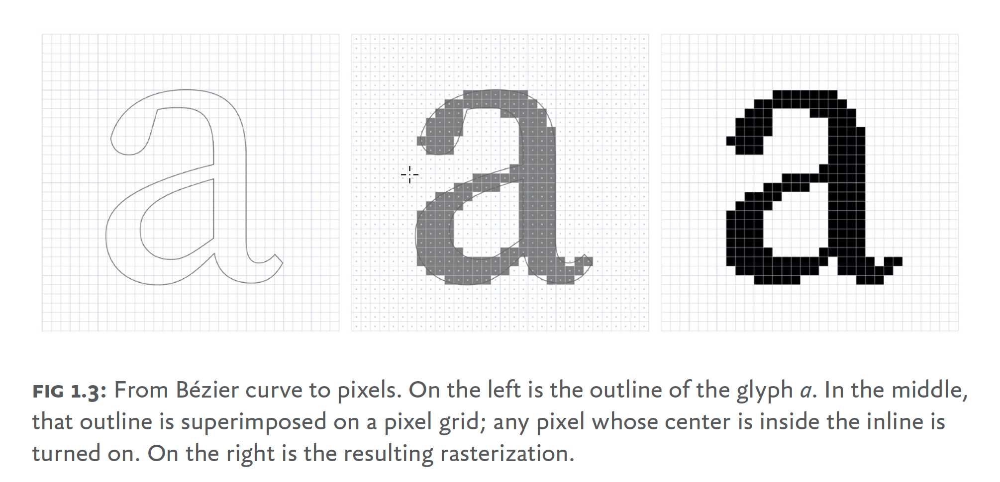

# 《Webfont Handbook》读书笔记

## 概述及术语

这本书成书于2017年，和我们一般理解的 icon font 不太一样的是，作者着重介绍的是“处理字体”的 web fonts，而不是“图标”。只是刚好 web font 能降维解决图标 icon 这件事，所以可以理解成这本书是 icon font 时代，并且针对 web 字体的一本专有领域技术手册>。

web fonts 相关技术诞生于2009年，直到成书的2016年，web fonts 也不算完全普及，据统计流量前1000的站点只有60%使用了 web fonts。当时使用 web fonts 甚至某种程度上算“bad practice”。书中举了一个极端的案例：


> THE MITT ROMNEY WEB FONT PROBLEM

Mitt Romney 宣布“不”参与总统竞选，但因为报道媒体在页面中使用了 web fonts，标题里的 Not 使用的是 web 字体，而在用户连接迟延尚未加载 web 字体的时候，界面上展示的就是“Mitt Romney 宣布参与竞选”，意思南辕北辙。

在字体这件事上，最重要的原则是“信息传达至上”，web fonts 应该是信息传达的辅助而不是阻碍。这本书给大家讲述了怎么样更好地利用 web fonts 技术，而不是让它成为站点的桎梏。

### 术语表

|英文|中译|涵义|
|---|---|---|
|Character|字符|代表字，具有唯一意义的符号。无论绘制展示的字形（Glyph）如何，意思不变|
|Typeface|字体|具备相同设计的一组字形集合，由一或多个字体设计师设计，可有多个变体样式|
|Style |样式 |字体的不同变体，譬如粗体、常规体、斜体等|
|Font |字体格式 |具体某个字体变体的交付物，譬如 Elena 是 Typeface，elena-regular.ttf 则是 Font|
|Glyph |字形 |某个字符的轮廓外形，譬如 a/A/A 都是字符 a 在当前字体下的不同字形|
|Family |字体族 |具备同一名称的不同字体格式的集合（Collection of Fonts in the same Typeface）|
|Foundry |字体商 |拥有字体版权的字体设计商家，譬如 Adobe|
|Language Script |“书文系”| |语言字符的书写系统，譬如英语和荷兰语都是拉丁文系，东亚文字的书文系比较复杂，中文有汉字文系和拼音文系，日语有 kanji 和 kana|
|Subsetting |字体子集 |从字体中移除当前上下文没有使用的部分，得到一个按需的子集。主要是性能优化|
|Text Rendering |字体渲染 |把字体字形展示到屏幕上的技术，因渲染引擎的不同实现，不同操作系统或者同一操作系统的不同引擎在展示同一个字形时会有差异（windows 内置两种以上引擎）|

## 第一章：选择 Webfonts

本书之前的著述在字体选择上一般会着重讨论字体设计。本书的观点是除美学因素以外，版权、托管模式、渲染质量和语言支持都是同等重要的。哪怕只是对比字体文字大小也不单纯比较数字即可，还需要考虑格式特性、语言支持等级等等。

### 版权

通常字体的版权会有 EULA（end user license agreement）来描述字体可以应用的方式和场合。总的来说，web fonts 的版权模型有五种：

‒ 买断（perpetual）
‒ 限制（limited）
‒ 订阅（subscription）
‒ 租赁（rental）
‒ 开源（open-source）

和商品交易不同，数字版权通常指的是使用权，亦即终端用户不能转卖所有权。但就我们关心的图标字体而言，目前主流的模式就是开源。但商业排版领域、涉及到复杂语言字体设计的场景下，字体使用权的交易是一门很大的生意，这门生意甚至一定程度上影响了操作系统、浏览器等技术领域（这也是为什么会有 ttf、otf、etf、woff 等各种各样字体格式的原因）。在商业使用的场景下，我们需要非常需要慎重考虑字体版权的问题。

针对五花八门的使用场景，字体设计师也会把字体派生出不同的子集，譬如不同渲染质量、不同语言支持等级的子集，从而获得更好的商业回报。这个也是技术上需要去关注的地方，也许有些商业版权的字体库，在某些场景下可能会有预期之外的渲染输出。

### 托管模式

独立部署还是依赖三方托管？如果有相应的专家能处理类似的技术问题，并且想要有更大的自助控制权，并且字体是买断或者限制使用授权的情况下，可以使用独立部署的方式。三方托管的模式适用于订阅、租赁场景。通常如果不希望处理太多技术细节，或者我们想要临时访问更多可供选择的字体库的时候，托管服务是不错的选择。

### 渲染质量



字体光栅化处理的基础流程，标记每个中心点在闭合贝塞尔曲线内部的像素点，然后填充字体颜色

哪怕购买了一个设计精良的字体库，它展示在终端用户设备上时也可能表现糟糕。整体而言字体渲染的质量主要取决于这几点：

‒ 字体本身的设计
‒ 提示指令（hinting instruction）
‒ 光栅化器（rasterization）

字形的存储是贝塞尔曲线，之所以用向量的形式存储而不是位图的形式，主要是字体需要跟随屏幕渲染尺寸做无损的放大缩小。光栅化就是把字形轮廓输出到屏幕像素，用对应颜色填充的过程。在高分屏上，渲染结果可以很好地还原字形轮廓，但低分屏的场景下采用基础流程光栅化的结果很多时候是不可接受的。这就需要借助字体渲染的提示指令（hinting instructions）来辅助还原。提示指令会指导光栅化器在特定场景下如何处理，也许是把字形范围往左右轻微偏移，从而达到更好的像素还原。

不同的字体格式存储提示指令和光栅化器的方式也有不同。市面上有两种主流的字体格式：Apple 和 Microsoft 共同开发的 TrueType 以及 Adobe 开发的 compact font format（CFF）。区别是 TrueType 处理不同屏幕尺寸下的字体还原更依赖提示指令，而 CFF 更依赖光栅化器。带来的结果是基于 TrueType 字体设计师可以对不同分辨率的处理有更高自由度，但同时会有更多额外的工作；CFF 需要手工调整的地方不多，但对光栅化器依赖很重。后者的优势会随着字体渲染引擎尤其是光栅化器的进化而扩大，而 TrueType 里对某些字体做的提示指令优化，往往并不能简单扩展到其他字体库。另外高分屏以后会越来越多，这对于 CFF 也是更有利的。

在以上提到的光栅化案例里，某个屏幕像素要么是纯色的，要么是无色的，这是没有应用抗锯齿的结果，在较小的文本渲染时会丢失一定的字形轮廓；抗锯齿的方式有两种，一种是“灰度抗锯齿”，通过计算某个像素点距离字形轮廓的比例，应用一定的灰度颜色，从而使字形轮廓边缘模糊化，可以更好地保留外形；更进一步的亚像素抗锯齿，则是引入了三原色做模糊化（屏幕上每一个像素点都有 R/G/B 加上透明度四个颜色通道），这样的优化结果轮廓更清晰，但也引入了一定的彩色边缘。


> 灰度抗锯齿和伽马校正


> 亚像素抗锯齿

不同操作系统下渲染质量也会有区别。目前业界有四个主流的字体渲染引擎：Windows 平台的 graphics device interface（GDI）、DirectWrite；MacOS 和 iOS 下的 CoreGraphics；Linux、Chrome OS 和 Android 下的 FreeType。这些渲染引擎都可以完成灰度抗锯齿和亚像素抗锯齿，亚像素抗锯齿在 Windows 下是“ClearType”，在 MacOS 下是“LCD 字体平滑”。

对浏览器而言，大部分浏览器目前都是直接采用操作系统的字体渲染引擎，只有某些比较古老的浏览器版本会内置一个不同的字体渲染引擎（updated in newer version of this book）。浏览器也提供了关闭亚像素抗锯齿的 CSS 属性：

```css
-webkit-font-smoothing: none; // none | antialiased | subpixel-antialiased (MacOS)
-moz-osx-font-smoothing: auto; // auto | grayscale | inherit | unset (FireFox)
font-smooth: auto; // auto | never | always | 2em
```

这里有个问题需要注意：当文本被旋转或者偏移或作动画的时候，会发生抗锯齿生成的像素和屏幕不对齐的情况，需要关闭灰度抗锯齿和亚像素抗锯齿。有些时候取消抗锯齿优化也会由浏览器自动完成（譬如亚像素抗锯齿降级到灰度抗锯齿）。


> 轻微旋转后的抗锯齿结果和屏幕像素不对齐

最终如果要确定具体场景里的渲染方案和效果，最直接的办法就是做字体渲染测试：


MacOS 下字体比 Windows 稍厚一点，这是 CoreGraphics 的智能优化逻辑导致的，他会让字形自动变厚

### 语言支持

没有一个单一的字体库能支持所有的语言和书写系。哪怕字体工程师想要创造这么一个字体库，也做不到，因为 OpenType 字体格式仅能存储 65536 个字形。并且有时字体文件也不仅仅是某个语言的文字，也可以包含其他字形，譬如符号、饰物、箭头等。这会带来一个问题：在浏览器里使用一个 web font 的时候，如果在具体使用的地方遇到了字体库不支持的 Unicode 字符，那么操作系统会把这个字符回退到使用兜底字体渲染，这样就会有明显的字体展示差异：


### OpenType 特性

除字形以外，字体文件通常还会包含 OpenType 特性，这些特性会影响某些字符或者某组字符的外观和行为。譬如大小写、连写、花体字等，都是 OpenType 支持的特性。标准支持的特性有超过140个之多，不过不是所有的特性都需要定义，也有一些特性是和具体某个书文系特定的。但总体而言，OpenType 的特性只有两类，一类是必须的特性，只有开启了这些特性，才能正确展示字符；另一类是可选的特性，这些特性可以改善文本渲染。


CSS 标准要求必须特性默认开启，包含这些：

‒ required ligatures (rlig)
‒ ligatures (liga)
‒ contextual ligatures (clig)
‒ contextual alternates (calt)
‒ kerning (kern)
‒ localized forms (locl)
‒ and features required for the display of composed characters and marks (ccmp, mark, and mkmk)

其他特性交由用户定义：

```css
p {
  font-variant: contextual, swash(1);
  font-feature-settings: "calt" on, "swsh" 1;
}
```

## 第二章：使用 Webfonts

这一章会直接考察一个 web font 在浏览器里使用时的问题，看看 @font-face 语法，看看字体文件格式，看一下浏览器是怎样加载和使用字体的。先看一个基础的案例：

```css
@font-face {
  font-family: Elena;
  src: url(elena-regular.woff);
}
```

指定字体集可以用 font-family 或者font 缩写。不过这里的定义有个问题：我们一定要为 web font 选定一个兜底字体，这样在字体文件没有加载或者字符在 web font 内没有定义的时候，内容也能展示出来：

```css
p {
  font-family: Elena, serif;
}
```

### 字体集（font family）

用不同的字体样式创建一个字体集只需要在font-face 里使用同一个font-family 名称即可：

```css
@font-face {
  font-family: Elena;
  src: url(elena-regular.woff);
  font-weight: normal;
}
@font-face {
  font-family: Elena;
  src: url(elena-bold.woff);
  font-weight: bold;
}
```

这个字体集就可以在 CSS 中通过指定字体集的方式应用到具体的选择器上：

```css
p {
  font-family: Elena, serif;
}
p strong {
  font-weight: bold;
}
```

除font-weight ,@font-face 以外，font-style 和font-stretch 配置后也会影响字形外观。

### 字体格式

@font-face 里的 src 属性是用来告诉浏览器如何加载字体文件的。之前的案例是使用单一的字体格式，但为了更好的兼容性，一般需要列举多个 URL：

```css
@font-face {
  font-family: Elena;
  src: url(elena-regular.woff2) format("woff2"),
       url(elena-regular.woff) format("woff");
}
```

最好把压缩比比较高的格式列到前面，这样如果支持的话可以显著降低网络开销。目前浏览器支持的主流字体格式有这些：

‒ TrueType+OpenType（苹果和微软联合开发，对标 Adobe 的排版字体格式。.otf / .ttf）
‒ Embedded OpenType（微软和 Adobe 联合开发，IE 里意图取代 TrueType 的格式，.eot）
‒ Web Open Font Format WOFF（Google 等厂商联合开发，对 TrueType/OpenType 的封装，加上 metadata。.woff）
‒ WOFF2（Google 开发，进一步提升压缩率30%。.woff2）

针对浏览器覆盖，目前覆盖最广的写法是这样的：

```css
@font-face {
  font-family: Elena;
  src: url(elena.eot?#iefix) format("embeddedopentype"),
       url(elena.woff2) format("woff2"),
       url(elena.woff) format("woff"),
       url(elena.otf) format("opentype"),
       url(elena.svg#elena) format("svg");
}
```

开头和结尾的 url 事实上比较特殊。开头是 IE-only 的，结尾的 SVG font 的支持早已经被大部分浏览器废弃了

如果不需要考虑最大范围覆盖面的问题，只考虑较新的浏览器的话，推荐的写法如下：

```css
@font-face {
  font-family: Elena;
  src: url(elena.woff2) format("woff2"),
       url(elena.woff) format("woff"),
       url(elena.otf) format("opentype");
}
```

相信不久之后，大家连 OpenType 也可以抛弃了，Web Open Font Format 在浏览器应用中是主流。

### 字体合成（font synthesis）

如果你定义的字体集没有包含某种样式，但用户使用了呢？譬如下述例子，字体集没有定义粗体，但 CSS 里指定了这种字体使用粗体：

```css
@font-face {
  font-family: Karmina, serif;
  src: url(karmina-regular.woff) format("woff");
  font-weight: normal;
}
h1 {
  font-family: Karmina, serif;
  font-weight: bold;
}
```

浏览器不会直接替换成兜底字体，而是会从已加载的字体文件中去“动态加粗”。斜体、细字体的处理也类似。不过这种结果通常不会很优雅。自动合成的字体和设计字体之间通常会有较大的差别：


> 合成字体 vs 设计字体

关闭合成字体可以在 CSS 里这么定义：

```css
p {
  font-synthesis: none;
}
```

最好的做法当然是确保你使用的所有字体样式都在 @font-face 中具体定义出来。

### 条件和懒加载

浏览器需要确保以下所有条件齐备，才会下载一个 web font。

‒ DOM 节点中具备文本内容
‒ 节点计算后的样式匹配到了 @font-face 中具体的 font-family 名称，以及对应的 font-weight 、font-style 和font-stretch 值
‒ 浏览器支持 src  属性定义的某个字体格式
‒ 节点的文本内容匹配到 unicode-range 定义的字符范围（如果定义了这个属性，且浏览器支持条件加载）

现代浏览器的这些条件带来了懒加载和条件加载的优势，使得字体加载效率更高。指定 unicode-range 参数后，浏览器会去遍历所有文本内容，如果有这个范围的字符，才去下载这个字体文件。案例：

```css
@font-face {
  font-family: Kanit;
  src: url(kanit-regular-latin.woff);
  unicode-range: U+0000-00FF, U+0131, U+0152-0153,
    U+02C6, U+02DA, U+02DC, U+2000-206F, U+2074,
    U+20AC, U+2212, U+2215;
}
```

在支持这个属性的环境里要尽可能开启，这会带来很好的优化效果。

### 性能开销

在加载 web font 的过程中，浏览器会做什么？大部分会把应用了这种字体的文本内容隐藏掉。当字体下载完成后，页面会重渲染，这叫 Flash of Invisible Text，或者 FOIT。


> FOIT

也有些浏览器会先立即使用兜底字体渲染文本内容，当 web font 加载完成后再替换。这个叫 Flash of Unstyled Text，或者 FOUT。


> FOUT


> 不同浏览器的策略

两种策略各有优劣，目前也有 font-display 属性可以控制这个行为。

```css
@font-face {
  font-family: ExampleFont;
  src: url（example-font.woff2）format（'woff2'），
       url（example-font.woff）format（'woff'）;
  font-weight: 400;
  font-style: normal;
  font-display: fallback;
}
```

## 第三章：优化性能

性能怎样衡量？站点和应用和性能可以通过几个核心的指标来评估：请求数、数据传输量、首次渲染时间。

web font 字体的性能也是性能评估的一部分。Amazon 在2017年前，一直拒绝使用 web fonts，因为对于他们的站点而言，越快的加载时间代表越多的成交量。2017年后网络带宽的改善终于让他们用上了 web fonts。

web font 的性能也可以通过三个指标来衡量：字体请求数、字体文件大小、首次渲染时间。而有时候性能优化不仅仅是真实性能，也需要考虑“体感性能”--让你的站点看起来很快。字体加载本身会阻断页面渲染，所以需要认真关注首次渲染时间。这些策略都会在本章详细描述。

### 减少请求

首次请求和后续请求都需要考虑。首次请求的时候，浏览器会从服务器加载所有所需字体资源，而后续请求里会有部分从缓存里复用。减少请求可以同时提高首次访问和后续访问的性能，而缓存只提升重复请求的性能，这两者对于实际性能和体感性能而言都至关重要。

减少总请求的第一个方法是仔细规划设计体系，减少字体设计的多样性和复杂度。总而言之就是慎重增加新的设计风格和 web fonts。另一个方法就是尽量使用系统字体。这样是最快并且体验最好的。

可惜“尽量使用系统字体”也不简单。推荐的做法是使用一个复杂的字体栈：

```css
font-family: -apple-system, BlinkMacSystemFont,
    "Segoe UI", "Roboto", "Oxygen", "Ubuntu",
    "Cantarell", "Fira Sans", "Droid Sans", "Helvetica Neue", sans-serif;
```

为解决系统字体多样性复杂性的问题，W3C 加了一个 font-family 属性：

```css
font-family: system-ui;
```

使用 HTTP/2 也是一个很好的方法，因为它允许多个请求复用一个连接，可以尽可能降低功耗。

这一章也讨论了使用 local storage 存储字体，不过这种做法不常见，也难以维护，不值得推广。

### 缓存

减少了字体文件请求后，我们就可以做下一步优化，把重复请求应用浏览器缓存。如果你使用的是在线 web font 服务，那可以不必关注这一点，因为合格的服务都已经正确应用了缓存策略了。如果是自己托管字体文字，一定要设置好对应的缓存规则：

```txt
Cache-Control: public, max-age=31536000
ETag: "53749a2f29f940c418e605adcb972f728bb511bc"
```

这个设置指定了资源最长缓存一年，ETag 是资源内容的唯一性标签（不要复制，这个是作者使用的实例文件的 hash 值）。

### 使用 CDN

如果进一步考虑延迟问题，使用 CDN 也是应该采用的方式。

### 减小字体大小

几条原则：

‒ WOFF2 > WOFF > OTF
‒ 尽可能使用unicode-range 
‒ 尽可能使用字体子集，而不是全集

以下是使用实例和一些可用的字体工具：

```css
@font-face {
  font-family: Source Sans Pro;
  src: url(latin-extended.woff) format("woff");
  unicode-range: U+0100-024F, U+1E00-1EFF, U+20A0-
    20AB, U+20AD-20CF, U+2C60-2C7F, U+A720-A7FF;
}
```

‒ Adobe Typekit 和 Google Fonts 都有生成子集的功能
‒ Fontsquirrel 也有类似的生成子集的界面
‒ Python 工具：fonttools
‒ Node.js 工具：glyphhanger

具体托管字体的时候，还需要考虑服务端压缩。如果使用了 OpenType / EOT 字体，一定要配置 GZIP 压缩。

### 拥抱 FOUT

作者认为 FOUT 的方式应该是默认的浏览器行为。因为 web font 对于站点而言，它不是目的，而是一种体验增强。站点核心永远是纯 HTML 和 CSS，因为传播内容才是目标本身。

在所有浏览器里采用 FOUT 的最简单的方法是使用 font-loading API 异步地加载字体。采用这种方法之后不需要手动去写 @font-face 规则了。譬如我们要使用 Abelard 字体：

```css
p {
  font-family: Abelard, Georgia, serif;
}
```

```javascript
const abelard = new FontFace('Abelard', 'url(abelard.woff2)', {
  weight: 'bold',
  style: 'normal',
  unicodeRange: 'U+0000-00FF, U+0131, U+0152-0153',
});
abelard.load().then(function () {
  document.fonts.add(font);
});
```

在暂不支持的浏览器环境里，备选的方案有两个：

‒ Adobe Typekit 的 Web Font Loader
‒ Font Face Observer

### 最小化 FOUT

很多人反对 FOUT 的原因是重排，加载并更换字体之后，往往会因为重新排版分散用户注意力。在字体设计上，每一个字形通常都会放到一个虚拟的方框内，这个方框被称作 em box。理论上设计师可以在 em box 任意地方放置字形，但在实践上通常大部分字形都会放置到 baseline 之上。x-height 与 baseline 之间的空间就是小写字母通常的字形空间（从字体 x 字母的高度计算而来，不同字体的 x-height 会有差别），字形低于 baseline 的部分称为下降区，高于 x-height 的部分是上升区。而 cap height 则是大写字母的高度上限，当然也有超出这些高度上下限甚至超出 em-box 外的例外情况（如下图）。


> 几种字形设计的例外情况

讲这么多，其实是为了阐明为什么更换字体会导致重排：不同字体设计的字形在宽高上会有细微差别，这些差别累积起来就会导致整个段落、乃至全文的重新排版。为减少字体重排，我们可以让选用的 web fonts 和对应的兜底系统字体尽可能靠近。两种办法：第一种是尽量选用字形尺寸上和 web font 靠近的系统字体作为兜底；第二种是通过 CSS 的 font-size-adjust 属性来对字体进行微调。


> 粗看 web font Geogrotesque 与 Gill 更接近


> 经过微调，Arial 是更好的兜底字体

```css
p {
  font-size: 1.2rem;
  font-size-adjust: 0.5;
}
```

font-size-adjust 的意思是让字体的 x-height 保持为字体高度的0.5倍，而浏览器会自动对字形渲染的高度进行微调。在不支持这个属性的浏览器环境里，我们可以结合上文提到的 font-loading 方案，在 web font 字体加载之后，给相应的段落加上 .font-loaded class，从而实现类似的效果：

```css
p {
  font-family: Arial, sans-serif;
  font-size: 1.2rem;
}
.fonts-loaded p {
  font-family: Geogrotesque, Arial, sans-serif;
  font-size: 1.296rem; /* 1.2rem × 1.08 */
}
```

这里就相当于变更 em-box 的大小，从而变相调整 web font 的 x-height，对齐兜底的系统字体

目前为止，我们讨论的都是在网络连接稳定的前提下，减少异步请求、缓存和优化字体加载等方案；那么如果网络连接不稳定呢？这是离线优先字体（offline-first web fonts）试图解决的问题。

### 离线优先的 web fonts

这里说的离线优先，指的是我们手动把首次加载到站点里的 web font 缓存起来，后续的相同字体请求都直接从缓存返回，而无需再发起实际请求：

```javascript
if ('serviceworker' in navigator) {
  window.addEventListener('load', function () {
    navigator.serviceWorker.register('/serviceworker-v1.js');
  });
}

// in serviceworker-v1.js
self.addEventListener('install', function (event) {
  event.waitUntil(
    caches.open('my-site-v1').then(function (cache) {
      return cache.addAll([
        '/path/to/font-regular.woff2',
        '/path/to/font-bold.woff2'
      ]);
    })
  );
});

self.addEventListener('fetch', function (event) {
  event.respondWith(
    caches.match(event.request).then(function (response) {
      return response || fetch(event.request);
    })
  );
});
```

## 第四章：展望

Web fonts 自09年诞生以来，已经经历漫长的发展。本章最后讨论一下已经出现的 web fonts 相关的新技术或者标准，虽然未来也许会出现变化，但仍然值得讨论一下。

### font-display

之前提过，这个 CSS 属性让选择 FOIT 还是 FOUT 的方式由浏览器托管改成让用户自己选择。

```css
@font-face {
  font-family: Abelard;
  src: url(abelard-regular.woff);
  font-display: block; // auto | block | swap | fallback | optional
}
```

auto 是浏览器默认行为；block 指的是在 web font 下载完成前阻断字体渲染（FOIT）；swap 则是先立即使用兜底字体渲染，后切换（FOUT）；fallback 和 swap 的行为有差别，它会等待100ms，如果 web font 100ms 以内加载完毕，则使用 web font，否则在等待3s的字体加载时间后再切换；optional 则只等100ms，如果 web font 加载完毕，则显示，否则直接使用兜底字体。

### 预加载

浏览器在解析到 @font-face 语句的时候，并不会立马加载字体（IE8及以下版本是例外，它们会下载所有定义的字体），而是会继续解析 DOM tree，仅当定义的字体被使用到了，才会进行下载。这是浏览器的默认优化行为，听起来没有任何问题。不过因为浏览器需要解析到具体每一个 text node，以及相关的 css，也就是全部 DOM、CSSDOM 都完成解析之后，才能获知这个信息；并且 CSSDOM 通常还依赖外部 stylesheet，因此这个过程会比较长，而且前面提到过，字体的加载和渲染是会对页面渲染或阻断、或重绘的，和图片之类的资源很不一样，会造成不太好的体验。

解决这个问题的标准也已经出现了，就是预加载（preload）。Chrome 和 Opera 都已经支持（最新的支持情况可以参考 caniuse/preload）。使用 preload 预先加载字体也很简单：

```html
<head>
<!--...-->
<link rel="preload" href="elena-regular.woff2" as="font" type="font/woff2" crossorigin>
<!--...-->
</head>
```


> 使用 preload 的字体渲染（正文部分加速渲染了）

### 有色字体（color fonts）

目前为止所用的 web fonts 的行为和系统字体一样，可以有颜色，但都是单一的实体颜色，没有渐变或者透明度，一个字形也不能拥有多种颜色。但因 emoji 的流行逼迫字体技术向更多彩的形态进化。苹果、谷歌和微软早已拥有各自专用的 OpenType 有色字体的扩展，而 Adobe 和 Mozilla 也合作研发了第四种。

|format|vendor|description|
|---|---|---|
|SBIX |Apple |PNG/JPEG/TIFF stored in the font.|
|CBDT/CBLC |Google |PNG stored in the font.|
|COLR/CPAL |Microsoft |Overlapping layers with color palettes.|
|SVG |Adobe & Mozilla |SVG stored in the font.|

有色字体目前已经获得了有限的浏览器支持（caniuse/color-font，主要是 COLR/CPAL v0 和 v1 格式），并且也已经有一些商用字体可供使用了：

‒ <https://fonts.adobe.com/fonts/trajan-color?ref=tk.com>
‒ <https://bixacolor.com/>

但更合理的方式，个人认为是区分两种使用场景：语言类的字体需求，还是用传统的 WOFF2，图标累需求，直接用 SVG，详见《从 IconFont 到 SVG Icon》。

### 可变字体（variable fonts）

2016年在 ATypl 会议上，OpenType 规范的一个重要补充（Spec1.8）可变字体（variable font）正式发布。和常规的字体不同，可变字体理论上包含字体的整个设计空间，而设计空间包含一种字体的所有可能的设计样式。举个例子，原来我们针对常规体（regular）、粗体（bold）、瘦体（thin）、黑体（black）等多种字体样式时，字体会按照样式分割成不同的字体文件，而可变字体则是包含其中一种权重的字体轮廓，加上推到其他任意权重样式的生成指令。所有的样式都是在运行时插值（interpolation）生成的。这种机制允许操作系统基于单一的轮廓创造近乎无穷的字体权重样式。

可变字体技术的一个限制是，插值本身仅适用于同一套贝塞尔曲线控制点，插值的过程无法新增控制点。绕开这个限制要么提过额外的轮廓数据，要么特性本身也使用变量插值，代价就是额外的轮廓数据存储开销。这会影响与默认样式显著不同的样式，譬如斜体。斜体的实现通常是一套新的轮廓数据，或者就是单独的可变字体文件。当然，这个场景下字重（font weight）不是唯一的可变量，还有其他四种：字宽（width）、光学尺寸（optical size）、斜体（italic）和斜率（slant）。设计师也可以自己定义其他变量以实现无线灵活的字体设计排版。这对于字体设计师和 web 开发人员都是好消息。

可变字体会给 web 开发带来很多便利，短期内显著的优化是性能上的。当然，如果仅使用一种简单字体，可变字体并没有什么优势，因为额外的轮廓存储和插值指令，字体大小甚至还会略微上涨。但如果同时使用一种字体的多种样式，可变字体的优势就很明显了。从长远看，可变字体带来的可能性是我们可以用相同的性能代价，使用更多的字体样式。这也为真正的响应式设计和更丰富的网页排版提供了新的可能性。

浏览器提供商和 W3C 也在努力改变 CSS 规范以支持 OpenType 的变体。新的提案让字体粗细、样式和 stretch 属性都可以接受数值输入，譬如 font-weight 可以接受1到999之间的任意值，而这些数值都会映射到可变字体的变量中去。

```css
p {
  font-family: Amstelvar, serif;
  font-weight: 652;
}
```

可变字体的 CSS 提案还带来了两个新的属性：font-optical-sizing 和 font-variation-settings 。前者允许浏览器基于字体大小和屏幕像素密度等自动选择合适的光学尺寸，后者是更底层的自定义可变字体属性的方式：

```css
p {
  /* Set the x-height axis to 672, and the weight axis to 541 */
  font-variation-settings: "xhgt" 672, "wght" 541;
}
```

可变字体惊人的灵活性也使得它可以成为很好的兜底字体，因为它可以通过变量调整为与 web fonts 相似的指标。希望操作系统尽快支持可变字体，这样我们也可以在 web 开发中使用系统自带的可变字体作为兜底了。

如大家所见，web 字体排版方向有很多令人兴奋的，最重要的是，也是非常有用的新发展。密切关注这些技术，可以有助于我们对 web fonts 的思考、改变使用方式。

### 总结

web fonts 是对网站的一种增强，而不是其他。它是可选的而非必需，它很有用很漂亮，可以改善站点的可读性和设计。

使用 web fonts 只需记住有限的几个原则：不要依赖浏览器的默认行为，尽量异步加载你的字体以免阻断文档渲染。另外如果版权允许，要始终优化你使用的字体，使用正确的格式和子集，并要考虑好字体样式的数量和缓存策略。

字体加载的性能前景是光明的，font-display 、preload  这些技术可以解决大部分字体加载的问题。以后随着浏览器的发展，很快大家都可以抛弃老的 EOT、原始 OpenType 格式，拥抱 WOFF2，这可以大大简化字体加载。另外只需要把 @font-face 定义到 CSS，设置 font-display 为 fallback，就可以得到很好的字体加载体验，用户会先看到兜底字体，直到 web font 被加载成功。

之后，记得在 HTML 头部加一个 prelaod 的指令，这样可以确保正文内容的字体优先加载。

这就是所有的原则了。当然如果浏览器和操作系统环境还不允许，可以使用本书介绍的使用 JavaScript 的字体异步加载方案。网页设计和开发与其他学科的其中一个不同在于，它的环境相对不可控。我们无法真正完全了解人们会在什么环境下消费内容。站点可能出现在任何地方：大屏幕、小屏幕、旧的浏览器、很慢的网络连接。我们需要设计并考虑所有这些可能性。

通过本书介绍的技术，相信大家可以了解 web fonts 的最佳使用方式：渐进增强。将兜底字体作为体验的基线，并使用 web fonts 增强它。记住一点：你的站点不需要在每种情况下都保持完全一致的外观，只要它是可访问的，访问站点的人就会心怀感激。
