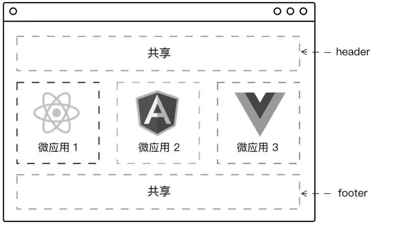
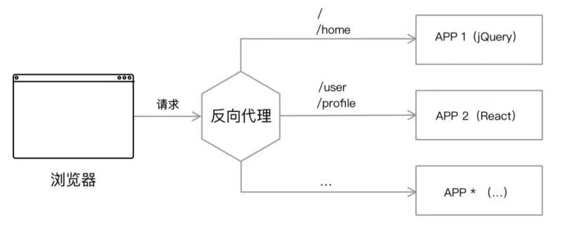
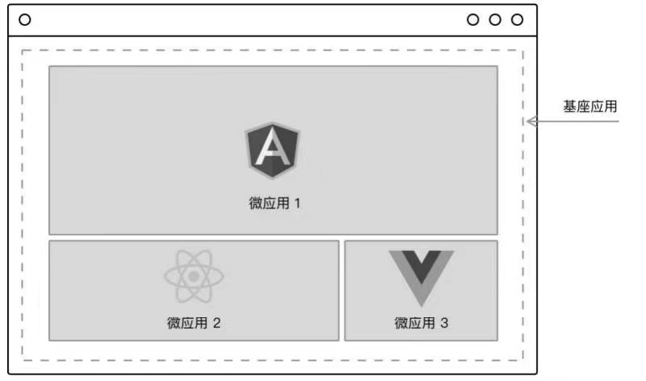
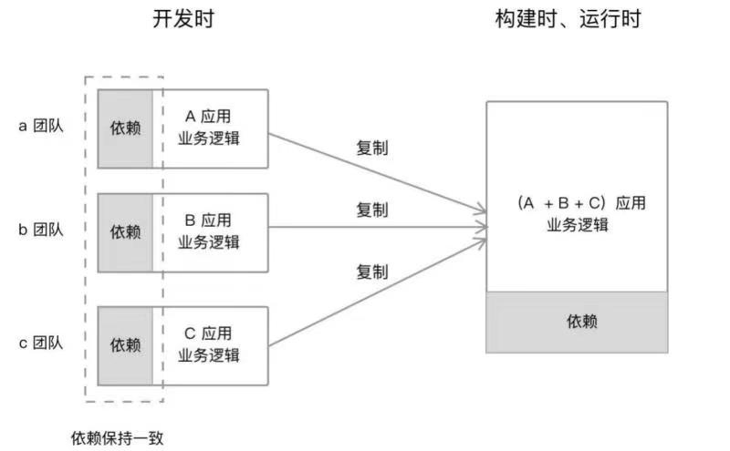
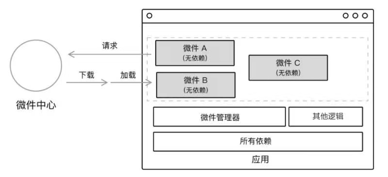
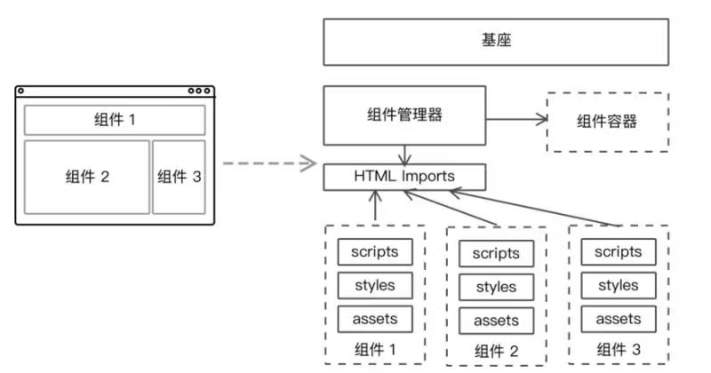
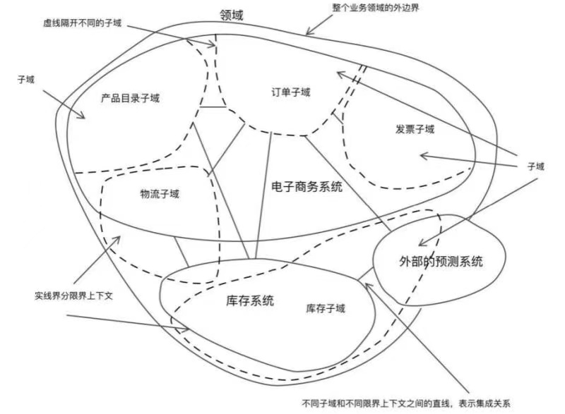
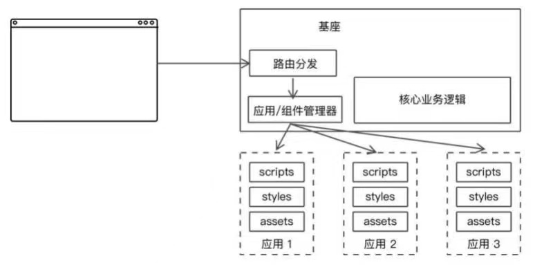

## 内容介绍

1. 什么是微前端架构？他是如何形成的，以及有什么优缺点。
2. 如何设计一个微前端架构的系统？
3. 如何合理的拆分前端应用？
4. 引入”微“害架构的概念，即不合理的实施微架构将对系统产生什么影响

## 1. 微前端

微前端是一种类似于徽服务的架构，它将微服务的理念应用于浏览器端，即将单页面前端应用由单一的单体应用转变为把多个小型前端应用聚合为一的应用

各个前端应用还可以独立开发、独立部署。同时，它们也可以进行并行开发，这些组件可以通过 NPM、Git TagGit或者 Submodule 来管理

#### 1.1 微前端架构

微前端的实现意味着对前端应用的拆分，它可以提升开发效率。比如10万行的代码拆成10个项目，每个项目一万行，要独立维护就会更容易。

我们只需要实现应用的自治---应用的**独立开发**和**独立部署**，就可以某种程度上实现微前端架构的目的。

##### 1. 应用自治

微前端架构是多个应用组件的统一应用，每个应用都可以由多个团队开发。要遵循统一的接口规范或者框架，以便于集成到一起，因此相互之间是不存在依赖关系的。

我们可以在适当的时候，替换其中任意一个前端应用，而整体不受影响。这也意味着我们可以使用各式各样的前端框架，而不会互相影响。

##### 2. 单一职责

与微服务类似，微前端架构满足理应满足单一职责的原则。

一旦业务上关联紧密，如B页面依赖A页面，A又在一定程度上依赖B页面，拆分开来就没那么容易。

如果业务关联少，如一些”我们的联系方式“等的页面，使用的不多，就没有太大难度

##### 3. 技术栈无关

在后端微服务架构中，技术栈无关是一个很重要的特性，后端可以选用合适的语言和框架来开发最合适的服务，服务之间通过API进行通过即可。

但是对于微前端架构来说，前端框架是有限的，且框架间的差距并不大，一个框架能做的事情，其他框架也都能做，与后端不同，java解决不了AI部分，可以交给Python，觉得java繁琐，可以使用Scala。

对于大部分公司和团队来说，如果一开始使用了React，除非新的框架能解决React不能解决的问题，否则大概率会一直沿用React。

此外，技术栈无关也有一系列的缺点：

- 应用的拆分基础依赖于基础设施的构建，如果大量应用依赖于同一基础设施，那么维护就变成了一个挑战。
- 拆分的粒度越小，意味着架构变得越复杂，维护成本越高。
- 技术栈一旦多样化，意味着技术栈是混乱的。

那么我们到底应该在什么时候采用微前端架构呢？

#### 1.2 为什么需要微前端

- 遗留系统迁移
- 聚合前端应用
- 热闹驱动开发

##### 1. 遗留系统迁移

存在大量使用Backbone.js、Angular.js等框架所编写的单页应用，且已经在线上稳定运行了，也没有新的功能。

##### 2. 后端解耦，前端聚合

后端微服务的初期最大的卖点是可以使用不同的语言、技术栈来开发后端应用，可以发挥不同技术栈的优势，也可以解耦各服务间的依赖。

而前端微服务化上是相反的，人们想要的结果是聚合前端应用，尤其是To B的应用。

类似移动应用，用户不想装太多应用，觉得关联性强的业务应该整合到一起。桌面Web端也类似，实现前端聚合的就是微前端架构

##### 3. 热闹驱动开发

软件开发团队可能存在很多没有经过踏实研究和实践的决策，而是一些不准确的意见，或者社交媒体的信息，称为”热闹“的东西。

那么对于这样一个”热闹“的技术，可能会导致项目的失败，合理的拆分可以避免较大的损失。

同样微前端也是”热闹“的技术，意味着也可能会积极的促进技术的发展更新。

## 2. 微前端的技术拆分方式

- 路由式分法
- 前端微服务化
- 微应用
- 微件化
- 前端容器化
- 应用组件化

#### 2.1 路由式分法

通过HTTP服务的反向代理，将请求路由到对应的应用上。

这是采用最多、最容易的”微前端“方式。

但这种方式看上去更像是多个前端应用的聚合，看起来像是一个整体，实则每当用户从A切换到B的时候，往往需要刷新一下页面、重新加载资源。

在这个架构中，只需要关注应用间的数据传递方式，通常只需要关注当前的用户状态，从A传到B即可，如果是同一个域下的话，就更加方便了，可以使用LocalStorage、Cookies、IndexedDB等。

缺点则是缺少了应用级别的状态处理，例如需要用户重新登录等。

#### 2.2 前端微服务化

每个前端应用都是完全独立的（技术栈、开发、部署、构建独立）、自主运行的，最后通过模块化的方式组合出完整的前端应用。

采用这种方式意味着一个页面存在多少个前端应用，而路由分法方案是一个页面只有一个应用。

我们只需要做到以下两点：

1. 在页面合适的地方引入或者创建DOM
2. 用户操作时，加载对应的应用（触发应用的启动），并且能卸载应用。

创建DOM是容易的，但是第二点不容易，特别是移除DOM和相应应用的监听，当我们拥有不同技术栈时，需要针对性的设计出这样一套逻辑。

同时还需要保证应用间的第三方依赖不冲突，如A使用的z插件，B也使用了z插件，如果一个页面多次引入z插件则会发生冲突，那么这也需要去解决。

#### 2.3 组合式集成：微应用化

在开发时应用都是单一、微小应用的形式存在，在运行时则是通过构建系统合并这些应用，组合成一个新的应用。

微应用化大都是以软件工程的方式来完成前端应用的开发的，因此又可以称之为组合式集成。对于一个大型的前端应用来说，采用的架构方式往往是通过**业务**作为主目录的，然后在业务目录中放置相关的组件，同时拥有一些通用的共享模板，例如：

当我们开发一个这样的应用时，从目录结构上看，业务本身已经被拆分了。我们所要做的是，让每个模块都成为一个单独的项目，如将仪表盘功能提取出来，加上共享部分的代码、应用的基本脚手架，便可以成为一个单独的应用。拆分出每个模块之后，便只需要在构建的时候复制所有的模块到一个项目中，再进行集成构建。

微应用化与前端微服务化类似，在开发时都是独立应用的，在构建时又可以按照需求单独加载。如果以微前端的单独开发、单独部署、运行时聚合的基本思想来看，微应用化就是微前端的一种实践。

只是使用微应用化意味着我们**只能使用唯一的一种前端框架**。大团队通常是不会同时支持多个前端框架的。

#### 2.4 微件化

微件（Widget），是一段可以直接嵌入应用上运行的代码，它由开发人员预先编译好，在加载时不需要再做任何修改或编译。

而微前端下的微件化则指的是，每个业务团队编写自己的业务代码，并将编译好的代码部署（上传或者放置）到指定的服务器上。在运行时，我们只需要加载相应的业务模块即可。在更新代码的时候，我们只需要更新相应的模块即可。

在非单页面应用时代，要实现微件化方案是一件特别容易的事。从远程加载JavaScript代码并在浏览器上执行，生成对应的组件嵌入页面。对于业务组件也是类似的，提前编写业务组件，当需要对应的组件时再响应和执行。在未来，我们也可以采用WebComponents技术来做这样的事情。

而在单页面应用时代，要实现微件化就没有那么容易了。为了支持微件化，我们需要做下面一些事情。

- 持有一个完整的框架运行时及编译环境。这用于保证微件能正常使用，即可调用框架API等。
- 性能受影响。应用由提前编译变成运行时才编译，会造成一些性能方面的影响——具体视组件的大小而定。
- 提前规划依赖。如果一个新的微件想使用新的依赖，需要从上游编译引入。

此外，我们还需要一个支持上述功能的构建系统，它用于构建一个独立的微件模块。这个微件的形式如下：

- 分包构建出来的独立代码，如webpack构建出来的chunk文件。
- 使用DSL的方式编写出来的组件。

为了实现这种方式，我们需要对前端应用的构建系统进行修改，如webpack，使它可以支持构建出单个的代码段。

这种方式的实施成本比微应用化成本高

#### 2.5 前端容器：iframe

iframe作为一个非常“古老”的、人人都觉得普通的技术，却一直很管用。它能有效地将另一个网页/单页面应用嵌入当前页面中，两个页面间的CSS和JavaScript是相互隔离的——除去iframe父子通信部分的代码，它们之间的代码完全不会相互干扰。

当然采用iframe有几个重要的前提：

- 网站不需要SEO支持。
- 设计相应的应用管理机制。

如果我们做一个应用平台，会在系统中集成第三方系统，或多个不同部门团队下的系统，显然这仍然是一个非常靠谱的方案。

此外，在上述几个微前端方案中，难免会存在一些难以解决的依赖问题，那么可以引入iframe来解决。无论如何当其他方案不是很靠谱时，或者需要一些兼容性支持的时候，可以再度试试iframe。

#### 2.6 结合Web Components构建

Web Components是一套不同的技术，允许开发者创建可重用的定制元素（它们的功能封装在代码之外），并且在Web应用中使用它们。

真正在项目上使用Web Components技术，离现在的我们还有些距离，可是结合Web Components来构建前端应用，是一种面向未来演进的架构。或者说在未来，可以采用这种方式来构建应用。比如Angular框架，已经可以将当前应用构建成一个Web Components组件，并在其他支持引入Web Components组件的框架中使用，如React。我们还可以使用Web Components构建出组件，再在其他框架中引入。

为此，我们只需要在页面中通过Web Components引入业务模块即可，其使用方式类似于微件化的方案

目前困扰Web Components技术推广的主要因素在于浏览器的支持程度。在Chrome和Opera浏览器上，对Web Components支持良好，而对Safari、IE、Firefox浏览器的支持程度，并不是很理想。有些不兼容的技术，可以引入polyfill来解决，有些则需要浏览器支持。

## 3. 微前端的业务划分方式

以下整理了常见的划分微前端的方式：

- 按照业务划分
- 按照权限拆分
- 按照变更的频率拆分
- 按照组织结构拆分
- 跟随后端微服务拆分

#### 3.1 按照业务划分

在大型的前端应用里，往往包含了多个业务。这些业务往往在某种程度上存在一定的关联，但并非是强关联。如图所示是一个常见的电商系统的相关业务。

在这样的一个系统里，同时存在多个子系统：电子商务系统、物流系统、库存系统等。

每个系统都代表自己的业务，它们之间的关联可能并不是很紧密——对于前端应用来说，只需要一个系统内对象的ID，加上用户的Token，便能轻松地从一个系统跳转到另外一个系统中。这种业务本身的高度聚合，使得前端应用的划分也变得更加轻松。

如果业务间本身的耦合就比较严重（如一个电子商务的运营人员，可能需要同时操作订单、物流等多个系统)，那么要从前端业务上分离它们，就不是很容易。

因此，对于由业务性质决定的应用，往往只能依据业务是否隔离来进行拆分。

#### 3.2 按照权限拆分

对于一个同时存在多种角色及多种不同权限的网站来说，最容易采用的方案就是通过权限来划分服务和应用。

尤其这些权限在功能上是分开的，也就没有必要集中在一个前端应用中。

#### 3.3 按照变更的频率拆分

在一个前端应用中，并非所有模块和业务代码都在不断地修改、添加新的功能。不同的业务模块拥有不同的变更频率。

有些功能可能在上线之后，因为用户少而**几乎不修改**；有些功能则可能为了做而做，即证明有这个技术能力，或者有这个功能。而有一些功能，因为是用户最常用的，所以在**不断迭代和优化**中。因此，可以依照变更频率来拆分前端应用。

不常用的功能，虽然业务少、变更少导致代码也相对较小，但是因为非核心业务数量多，从应用中拆分出去也更容易维护。比如Word这样的文字处理软件，我们日常使用的功能可能不到10%。而其他一些专业性的需求，则仍然有90%的空间，它们也需要花费大量的开发时间。若是将应用中频繁变更的部分拆分出来，不仅更容易维护其他部分的代码，还可以减少频繁的业务修改给其他部分带来的问题。

经常变更的业务也可以进一步进行拆分——拆分成更多的前端应用或者服务。使用变更的频率进行拆分的前提是，我们使用数据统计来计算各部分的使用情况。对于一个大型的前端应用来说，这部分几乎是不存在问题的

#### 3.4 按照组织结构拆分

团队的组织方式必然会对它产生的代码有影响，既然如此，就会存在一种合理的微前端划分方式，即根据不同团队来划分不同的微前端应用及服务。

对于后端来说，按照组织结构拆分服务，几乎是一个默认的做法。团队之间使用API文档和契约，就可以轻松地进行协作。

对于前端应用来说，同样可以采用这种方式来进行。

当作为架构的提出方和主要的核心技术团队，我们需要提供微前端的架构方案。如使用路由分发式微前端，需要提供一个URL入口；使用前端微服务化，需要提供一个API或者接入方式，以集成到系统中。

值得注意的是，它与业务划分方式稍有区别，一个团队可能维护多个业务。如果某些业务是由一个团队来维护的，那么在最开始的阶段，他们可能倾向于将这些业务放在同一应用中。然后，由于业务的增多或者业务变得复杂，则会进一步拆分成多个应用。

对于跨团队协作来说，集成永远都是一个复杂的问题。尤其在团队本身是异地开发的情况下，沟通就变成一个麻烦的问题。技术问题更适合于当面讨论，如指着代码或页面进行讨论。一旦有一方影响了系统构建，就需要优先去解决这个问题。

#### 3.5 跟随后端微服务拆分

微架构相关的实施，并不只有前端才有，往往是后端拥有相应的实施，前端项目才会进行进一步的拆分。而一旦后端拥有相关的服务，前端也可以追随后端的拆分方式。

然而，后端采用的拆分方式，并不都适合于前端应用——可能多数时候都不适合。如后端可能采取聚合关系来划分微服务，这时对于前端应用来说并没有多大的启发，但是有些时候还是可以直接采用一致的拆分模型。毕竟如果在后端服务上是解耦的，那么在前端业务上也存在一定解耦的可能性。

#### 3.6 DDD与事件风暴

在后端微服务（MicroServices）架构实践中，常常借助于领域驱动设计（Domain Driven Design，DDD）进行服务划分。DDD是一套综合软件系统分析和设计的面向对象建模方法。DDD中的一个限界上下文（Bounded Context），相当于一个微服务。而识别限界上下文的核心是，识别出领域的聚合根，这时便依赖于事件风暴来进行。

事件风暴（Event Storming）是一项团队活动，旨在通过领域事件识别出聚合根，进而划分微服务的限界上下文。事件风暴就是把所有的关键参与者都召集到一个很宽敞的屋子里来开会，并且使用便利贴来描述系统中发生的事情。它们会通过以下步骤来确定各个业务的边界，同时划分出每个服务：

- 寻找领域事件
- 寻找领域命令
- 寻找聚合
- 划分子域和限界上下文

## 4. 微前端的架构设计

在有了微前端之后，我们是否真的需要微前端？我们能否应对微前端带来的技术挑战？

#### 4.1 构建基础设施

在基础设施上，微前端架构与单体应用架构有相当大的差异。在单体应用里，共享层往往只有一个。而在微前端架构里，共享层则往往存在多个，有的是应用间共用的共享层，有的是应用内共用的共享层。在微前端设计初期，构建基础设施要做如下几件事情：

- 组件与模式库。在应用之间提供通用的UI组件、共享的业务组件，以及相应的通用函数功能模块，如日期转换等。
- 应用通信机制。设计应用间的通信机制，并提供相应的底层库支持。
- 数据共享机制。对于通用的数据，采取一定的策略来缓存数据，而不是每个应用单独获取自己的数据。
- 专用的构建系统（可选）。在某些微前端实现里，如微件化，构建系统用于构建出每个单独的应用，又可以构建出最后的整个应用。

针对不同的微前端方案会有不同的差异。

#### 4.2 提取组件与模式库

系统内有多个应用采用同一框架的微前端架构，模式库作为微前端架构的核心基础，可以用于共享代码。在这个库里，它会包含我们所需要的基础组件，可以在多个前端应用中使用。

##### 1. 样式

在实施微前端的过程中经常会遇到一个头疼的问题：样式冲突。如果在一个页面里同时有多个前端应用，那么就会存在以下几种形式的样式：

- 组件级样式，只能用于某一特定组件的样式。
- 应用级样式，在某一个前端应用中使用的样式。
- 系统级样式，可在该页面中使用的样式，往往会影响多个应用。

对于组件级样式来说，有些框架可以从底层上直接支持组件模式隔离，只要在开发的过程中多加注意即可。

对于应用级样式而言，则需要制定一个统一的规范，可以根据应用名加前缀，如dashboard-，也可以根据路由来增加相应的前缀，以确保应用本身的样式不会影响到其他应用。此外，我们往往会为这些应用，创建一个统一的样式库，以提供一致的用户体验。

系统级样式，大抵只存在于基座模式设计的微前端架构里。在这种方案里，由基座应用来控制其他应用，也存在部分的样式。在编写这些样式的时候，需要注意对其他应用的影响。此外，它也可以作为统一的样式库承载的应用来使用。

##### 2. 业务组件及共享库

对于在多个应用中使用的业务组件和共享函数，我们既可以提供NPM包的方式，又可以提供git submodule的方式，引入其他应用中。

对于通用的组件，它在开发的前期需要频繁地改动，这时可以将其抽取成为子模块（Submodule）的形式在项目中使用。当我们需要的时候，可以轻松地修改，并在其他应用中更新。当这些组件趋于稳定的时候，可以尝试将其作为NPM包发布。如果有这种打算，就需要在这个子模块中使用package.json及NPM的管理方式，方便后期直接扩展。

此外，不得不提及的是，这种类型的修改应当是兼容式修改。在难以兼容的情况下，需要对系统中使用到的部分，逐一进行排查，直到确认已更新下游API。然后，还要进行相应部分的测试，以确保组件修改带来的影响都已经被修复。

#### 4.3 应用通信机制

解决了应用间共享代码的问题，我们还需要设计出一个应用间通信的机制。在微前端架构里，从应用间的关系来看，存在如下两种类型的通信：

- 同级通信，即挂载在同一个HTML Document下的应用间的通信。
- 父子级通信，即采用iframe形式来加载其他应用。

前者往往通过全局的自定义事件（CustomEvent）便可以实现。值得一提的是，在IE浏览器上需要使用Polyfill兼容库。此外，由于应用之间共享一个Window，所以我们还可以开发自己的发布-订阅模式组件。与自定义事件相比，它拥有更高的可定制度。
如果采用父子级通信机制，则稍显麻烦一些。普通的父子级通信可以做到以下几方面：

- 通过PostMessage在父子窗口之间进行通信。
- 透过parent.window寻找到父窗口，再发出全局的自定义事件。
- 当其他应用加载时，将消息发送给父窗口，由父窗口发出自定义事件。
- 当其他应用未加载时，先将消息传递给父窗口，再由父窗口进行存储，提供一个获取通信的机制。

在实施过程中，具体采用哪种或哪几种方式，取决于我们在设计的时候有哪些需要。也可以在前期设计出所有的机制，方便后期使用。
值得注意的是，在实现的过程中往往会出现两种结果：

- 嵌入业务的特定通信机制。
- 剥离业务的通用通信机制。

后者是一个通用的通信机制，开发成本相对较高。前者则是一个业务绑定的模式，一旦添加新功能，便需要进行修改。

#### 4.4 数据管理

单页面应用是指对于业务状态的管理及处理。前端在与后端进行交互时，需要传递大量的状态，这时的状态主要由两个部分来组成：URI（GET的传递参数会转换到URI中）+请求body。由于一个应用持有这些状态，所以为了实现方便，需要在应用间共享这些数据。

应用的数据管理可以分为两部分，一部分是状态，另一部分则是应用数据。只是从某种意义上来说，状态是一种特殊的应用数据，它更加显式地展示数据。通过上部分的应用通信机制，可以解决部分数据共享问题，通用部分的数据，则可以选择一个合适的数据管理策略。为此，我们需要一个去中心化的管理数据，或者基于基座应用的数据管理机制。

常见的数据交互方式，有以下几种：

- URI参数传递。
- 使用LocalStorage共享数据。
- 其他客户端存储，如IndexedDB、Web SQL等。
- 服务端存储客户端状态，可以采用JSON格式存储。

在这方面，我们很难通过实施一套有效的方案来管理，往往是通过规范来保持一致，如在某些情况下使用URI传递参数，在某些情况下应用自身从LocalStorage获取。如果设计了自己的安全存储策略，就另当别论了。

#### 4.5 专用的构建系统

首先需要声明一下，并非所有的微前端架构都需要一个专用的构建系统。只有那些依赖于构建及构建工具创建出来的微前端应用，才需要设计出一个专用的构建系统，以支撑系统的开发。

如果我们采用了微应用化、微件化的架构方案，就需要设计自己的构建流程、构建系统，每种方式在具体实现上各有差异。

- 微件化需要修改构建工具，如添加对应的构建插件，使它能支持构建出组件包

- 微应用化则依赖于设计构建流程，而不需要对构建工具进行修改

## 5. 微前端的架构模式

#### 5.1 基座模式

在这种模式的微前端架构中，基座承担了微前端应用的基础与技术核心。

基座模式，是由一个主应用和一系列业务子应用构成的系统，并由这个主应用来管理其他子应用，包括从子应用的生命周期管理到应用间的通信机制。

基座模式中的主应用，类似于API Gateway的概念，它作为系统的统一入口，负责将对应的请求指向对应的服务。子应用，则是负责各个子模块的业务实现，如图所示。

这个主应用，既可以只带有单纯的基座功能，也可以带有业务功能。它所处理的业务功能指的是核心部分的业务功能，如：

- 用户的登录、注册管理。
- 系统的统一鉴权管理。
- 导航菜单管理。
- 路由管理。
- 数据管理。
- 通信代理。
  ……

作为应用的基础核心，它还需要：

- 维护应用注册表。在应用注册表上表明系统有多少个服务、能否找到对应的应用等。
- 管理其他子应用。如在何时加载应用、何时卸载应用等。

要实现这种模式的微前端架构，只需要设计好对应的应用加载机制即可，因此在实施的时候也比较方便。

#### 5.2 自组织模式

自组织指的是，系统内部各子系统之间能自行按照某种规则形成一定的结构或功能。采用这种模式可以使系统内的各种前端应用，都各自拥有一个小型的基座管理功能，也相当于每个应用都可以是基座。

在采用基座模式时，用户要想访问A应用需要先加载主应用，然后才能加载A应用。采用自组织模式时，用户想要访问A应用则只访问A应用，不需要加载主应用，这也因此使它拥有了更高的自主性。

不过多数时候，我们并不需要自组织模式的微前端架构，因为它设计起来复杂、拥有大量的重复代码。

## 6. 微前端的设计理念

在笔者实践微前端的过程中，发现以下几点是我们在设计时需要关注的内容。

- 中心化：应用注册表
- 标识化应用
- 应用生命周期管理
- 高内聚，低耦合

它们也是我们在实践微前端的过程中所要考虑的要点。

#### 6.1 中心化：应用注册表

微服务从本质上说应该是去中心化的。但是，它又不能完全去中心化。因为对于一个微服务来说，它需要一个服务注册中心：服务提供方要注册通告服务地址，服务的调用方要能发现目标服务。

对于一个前端应用来说，我们也需要拥有一个应用注册表，它将拥有每个应用及对应的入口。在前端领域里，入口的直接表现形式可以是路由，或是对应的应用映射。应用在构建完成，或者部署到服务器后，应该在这个应用注册表中注册，才能及时地向其他应用提供访问的权限。
以路由形式的注册表为例，当我们添加了一个新的应用时，就相当于在网页上添加了一个菜单链接，用户就能知道哪个页面是可以使用的，也就能访问到这个新的应用。从代码上来说，就是我们需要有一个地方来管理应用：目前存在哪些应用，哪个应用使用哪个路由。

应用注册表可以是一个配置件，也可以是一个后端服务。由于它是面向前端提供的，其表现形式往往是JSON，在这个文件中，可以配置微前端加载规则。

#### 6.2 标识化应用

标识化应用是指，建立某种规则来区分不同的应用，类似于唯一标识符，即ID。我们需要这个ID来标识不同的应用，以便在安装和卸载的时候，能寻找到指定的应用。

对于第三方应用来说，我们往往会给它们添加对应的前缀，如3rd-xxx，以区分不同的应用。并且第三方应用需要向系统申请，才能接入这个系统中。

如果存在大量的不需要审核的应用，那么可以由系统后台来生成唯一的标识符。

#### 6.3 生命周期

前端微架构与后端微架构的最大不同之处则是**生命周期**。微前端应用作为一个客户端应用拥有自己的生命周期，生命周期包括如下3个部分：

1. 加载应用
2. 运行应用
3. 卸载应用

在微前端框架Single-SPA中设计了一个基本的生命周期，其包含如下5种状态。

- load：决定加载哪个应用，并绑定生命周期。
- bootstrap：获取静态资源。
- mount：安装应用，如创建DOM节点。
- unload：删除应用的生命周期。
- unmount：卸载应用，如删除DOM节点、取消事件绑定。

这部分的内容事实上就是微前端的一个难点所在，如何以合适的方式来加载应用呢？每个前端框架都各不相同，其所需要的加载方式也是不同的。当我们决定支持多个框架的时候，便需要在这一部分进行更细致的研究。

#### 6.4 高聚合，低耦合

最后，在设计各个子应用及主应用的过程中，需要遵循高内聚、低耦合的原则。

高内聚，即模块内的关系，一个软件模块只由相关性很强的代码组成。设计的过程就是识别、度量模块内的联系，再将相关的行为聚集在一起，把不相关的行为放在别处。如果想要修改模块中某一部分的行为，只需要修改一处代码即可，而不需要修改多处。在实践的过程中，主要基于单一职责和关注点分离两个原则来实现。

低耦合，即模块间的关系。对于微架构系统来说，在服务之间、应用之间如果实现了松耦合，那么修改一个服务和应用就不需要修改另一个服务和应用。除了基座应用，每个应用都不应该关心协作应用的相关信息。

应用之间往往存在一定的依赖关系，要解耦这些依赖，就需要将数据独立出来，并使用通信的方式来传递状态。

## 7. “微”害架构

一个架构有好的一方面，实施不好则有害。

“微”害架构，即微架构以不合理的方式运行着，它采用“微架构”（微服务、App插件化、微前端等）技术拆分臃肿的单体应用，导致软件架构进一步复杂化，难以维护，使得原本具有优势的微架构出现一些问题。

为什么一个设计良好的架构，会变成一个人人嫌弃的架构呢？我们可以轻松地列举出如下理由：

- 架构的设计不符合演进的需求。
- 开始设计时，架构就不合理。
- 架构本身是合理的，后继的开发者能力不足。
- 架构本身是合理的，然而开发的过程中走歪了。

关于能力不足导致的架构问题就不进一步展开讨论了，我们主要讨论的是“走歪了的流程”，它才是导致“微”害架构的元凶。在开发能力完备的情况下，架构走向不合理的原因是KPI。由KPI导向的系统架构设计，必然会出现一定的不合理性。

- “我们的竞争对手采用了微服务架构，你看看我们有没有办法也用这个架构？”
- “隔壁开发小组的团队使用了微前端架构，我们也上这个架构吧？”
- “小李啊，听说最近微服务很火啊，你看能不能用到我们的项目上？”
  ……

问题的原因多种多样，如没有因地制宜地实施架构——A项目有50个后端开发，后端由20个微服务组成；B项目有10个后端开发，也由20个微服务组成。每次上线的时候，不得不出动所有的人，上线到半夜才算完成。
下面让我们了解、回顾一下系统的架构形成。

#### 7.1 微架构

在过去的几年里，笔者曾参与了一系列“微架构”相关系统的开发。对于不同类型的应用程序，它们的改变方式也有所不同。后端应用从单体应用拆分成一个一个微服务，它们对于用户来说是不可见的，但对于自身的客户端而言，仍然是一个整体；前端和移动应用则正在从一个一个的应用，整合成一个大的整体。然而客户端又稍有不同，它们需要实现在开发时拆分，构建时聚合。与微架构开发类似的有：

- 后端拆分。其典型的形式是微服务，以微服务的实现来说，不同部门的服务也往往是独立存在的，在架构上后台本身也是互不干扰的。只要保证接口API是正常的，就不需要关心其项目背后的技术栈。将其与App和前端进行对比，就会发现后端微服务是特别容易实现的。组织内部的不同开发团队，只需要保障API是稳定可用的、API是丰富的，不需要过多地讨论会议。
- App拆分。App存在多种容器，有插件化、组件化、小程序等不同的方案。由于一个大型组织的App所承载的功能相当丰富，其有可能拥有不逊色于操作系统的代码量。要实现跨团队共同在一个代码库开发，并不是一件容易的事。因此采用一个App平台的方案，让不同部分的业务可以在上面运行，是一个更符合组织架构的开发模式。
- 前端拆分。大规模前端应用的开发历史要比App短得多，但是也出现了一系列的拆分方案：前端微服务化、微应用化、微件化，等等。前端走向微前端架构的原因，除了庞大的单体应用，还有一部分是要聚合旧的遗留应用。我们希望旧的遗留应用，能不经修改或者少量的修改，就可以嵌入新的系统中。

#### 7.2 架构的演进

回过头来看，大型项目的架构演进，无非就是：

1. 我有了一个Idea，快速地设计出原型1.0版本，并推向市场，效果还不错，赚到一些钱。
2. 市面上的竞争对手越来越多，为了赢得这场战争，我们在2.0版本的系统里添加了越来越多的功能，一个臃肿的单体应用。
3. 随着时间的推移，添加新功能的难度越来越大，于是我们设计出了3.0版本的系统——在今天这个节点里，就是微服务架构。

这就是《Linux/Unix设计思想》一书中所提到的三个系统，毫无维和感：

1. 在背水一战的情况下，人类设计出了第一个系统。
2. 专家们在第一个系统的基础上，做出了伟大而臃肿的第二个系统。
3. 受累于第二个系统的人，设计出了第三个系统。

可故事并不能因此而结束。随着时间的推移，受益于第三个系统的人们，又有一部分组织会回到第二个系统。

大部分组织会意识到三个系统的存在。于是，在根据Idea设计一个新系统的同时，采用了第三个系统的架构，然后出错了——因为他们缺少专家。这里的专家并非单纯指技术方面的专家，而是技术专家+业务专家，他/她可以是一个懂业务的技术专家，或者是一个懂技术的业务专家。架构在底层是由技术实现的，而在顶层则是由业务代码实现的。

业务层的耦合直接影响了技术上的耦合。这个困境导致了技术架构在不断变化

#### 7.3 微架构带来的问题

在不同的微架构领域里，他们有着不同的问题。在考察是否使用某项技术的时候，我们就会考虑这些问题。而在这个时候，我们的第一答案是：“直接使用这种架构，具体遇到什么问题再解决”。是的，现在让我们来戳破这些问题，看看有没有对应的解决方式。

##### 1. 后端：微服务到应用

实施过后端微服务的开发人员，想必对微服务也有一系列的看法。在不正确的实施之后，不少人会对微服务有所不满。尽管如此，他们都会承认微服务在隔离服务之间的价值。但是当带来的问题远大于收益时，微服务就变得不值得采用了——要么问题不好解决，要么问题解决不了。

在项目上实施的时候，笔者发现有一些额外的问题：

- 代码架构。在不同的组织之间采用微服务架构，对于相互之间都是有好处的。但是在一个小型的内部组织里，掌握代码独立的微服务数量就值得考虑了——既然不需要和别人沟通，为什么需要在十多个repo间切换？
- 部署流程。微服务讲究独立开发、独立部署，如果一个微服务不能独立部署（有些固定的上线周期），那么部署就变成一件痛苦的事。如果在一次release计划里，我们需要同时上线十几个服务，就变得……

那么，在这种情况下，这些开发者就在考虑，采用微服务架构是否值得。实际上这个问题的本质可能是，是否有独立拆分微服务的必要？或者采取集成构建的方式，在开发和构建时来独立两个应用，在部署时只部署一个应用。

##### 2. 客户端：插件化、组件化

App可以分为插件化和组件化两种方式。插件化是集成构建完成后的APK包，而组件化（Module）则是集成构建后的模块（Lib）。Web前端的拆分则可以是微前端、微应用和跨框架组件化几种形式。

不论采用哪种方式，每一个微小的部分，最后都可以在同一框架内运行。不同的实现方式，稍有一些区别。有些架构实施起来很轻松，但是在维护后却变得相当麻烦。实际上往往有很多架构在实施的时候就很麻烦，更不用说在后期维护了。

业务的价值往往以大前端的形式呈现，因此移动应用在代码的拆分上，往往比后端容易。不论采用动态加载、UI跳转、路由或者其他形式，都要考虑如何来拆分代码。于是我们就遇到问题了：

一个简单的业务，是否有必要成为一个简单的服务？当我们有一系列简单的功能时，它们真的要独立运行。它们是否有必要成为多个简单的组件？它们不能是一个组件来接受多个参数吗？

面对这些问题，我们可以采取合适的代码拆分策略，以便在未来合适的时候进行拆分。限制我们这么做的主要原因是，后期拆分的时候会面临巨大的挑战。

#### 7.4 解决方式：可拆分式微架构

要合并多个后端服务，就要统一它们的技术栈，但是他们的技术栈会是一样的吗？在多数组织里，技术异构是存在的——只存在于少量数据服务中。在大多数情况下，他们都是使用同一种技术进行构建的。同一个语言或同一个框架，可以降低学习成本。一些不易实现的特性如机器学习、深度学习等，则使用Python等拥有丰富AI生态的技术栈来构建。

此时，我们只需要保证可以成功构建即可，如微应用化就是一种构建时集成的方式。当然，这有可能又一次回到“锤子定律”的问题中了。
这种方式并不违反微服务的一系列原则，服务自治、专注的服务等。如果我们主要修改的代码在某一个特定的服务里，那么我们只需要将它们拆分出来独立部署。

同样的道理适用于App插件化和前端微应用化。如果没有规范化的开发流程，架构之间可能会出现进一步的耦合。

阅读资料：

《前端架构：从入门到微前端》- 黄峰达（Phodal）编著

ps：本章节图片是笔者书中的截图，如有侵权，请联系作者删除，谢谢。