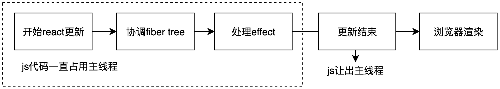
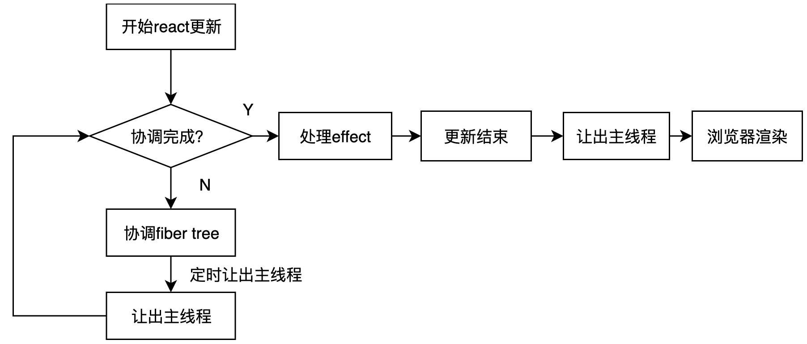
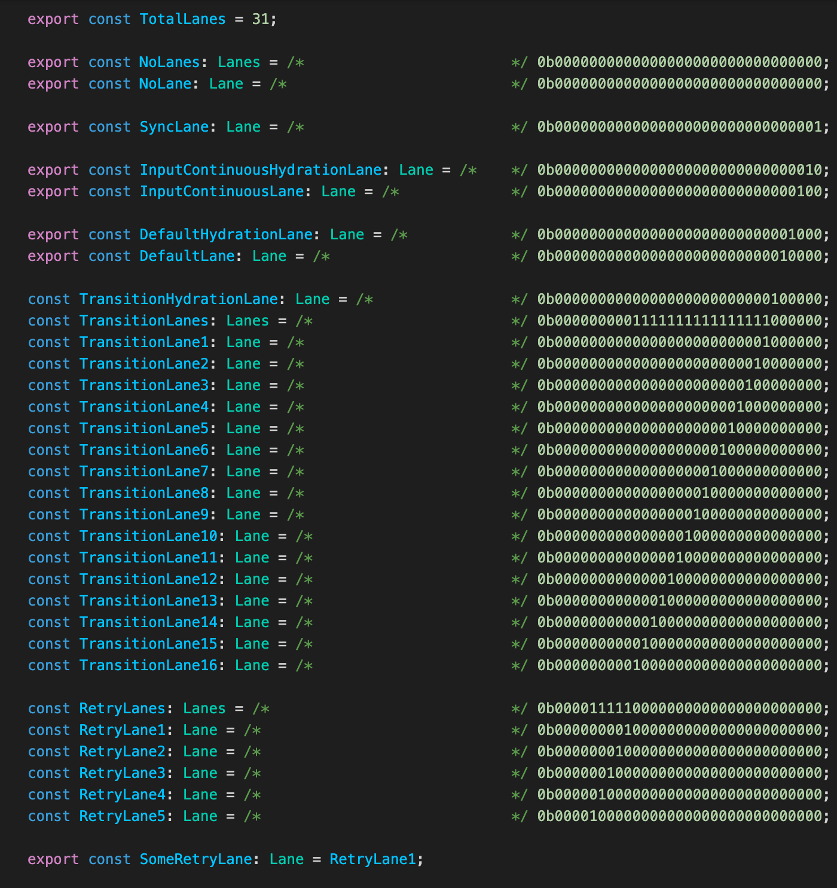

# Transition 使用姿势

Transition 是 react18 引入的新概念，用来区分紧急和非紧急的更新。

- 紧急的更新，指的是一些直接的用户交互，如输入、点击等；
- 非紧急的更新，指的是 UI 界面从一个样子过渡到另一个样子；

react 官方的 demo 如下：

```
import {startTransition} from 'react';

// Urgent: Show what was typed
setInputValue(input);

// Mark any state updates inside as transitions
startTransition(() => {
  // Transition: Show the results
  setSearchQuery(input);
});
```

有 2 个 API：

- useTransition：hook，用在 function 组件或其他 hooks 中，能返回 isPending；
- startTransition：用在不能使用 hooks 的场景，如 class 组件中，相比 useTransition 不能获取 isPending 状态；

2 个 API 还有一个差别：当进行连续快速输入时，使用  startTransition  是无法触发类似 throttle 的效果的。

# Transition VS throttle、debounce

throttle demo：https://codepen.io/yuanfeng/pen/gOvxEPM

存在的问题：

- 到达指定时间后，更新开始处理，渲染引擎会被长时间阻塞，页面交互会出现卡顿；
- throttle 的最佳时间不易掌握，是由开发者设置的时间。而这个预设的时间，在不同性能的设备上不一定能带来最佳的体验；

debounce demo：https://codepen.io/yuanfeng/pen/RwQZdbN

存在的问题：

- 会出现用户输入长时间得不到响应的情况，如上例中虽然输入框中内容一直在变但下面区域内一直不变；
- 更新操作正式开始以后，渲染引擎仍然会被长时间阻塞，依旧会存在页面卡死的情况；

useTransition demo：https://codepen.io/yuanfeng/pen/gOvxjPw

用 transition 机制的效果：
- 用户可以及时看到输入内容，交互也较流畅；
- 用户连续输入时，不会一直得不到响应(最迟 5s 必会开始更新渲染列表)；
- 开始更新渲染后，协调过程是可中断的，不会长时间阻塞渲染引擎（进入浏览器渲染阶段依然会卡住）；

transition 相比前两种方案的优势：

- 更新协调过程是可中断的，渲染引擎不会长时间被阻塞，用户可以及时得到响应；
- 不需要开发人员去做额外的考虑，整个优化过程交给 react 和浏览器即可；

# transition 实现原理

## isPending 实现原理

我们看到页面首先进入了 pending 状态，然后才显示为 transition 更新后的结果。这里发生了 2 次 react 更新。但我们只写了一个 setState。

```
function App() {
  const [value, setValue] = useState("");
  const [isPending, startTransition] = useTransition();

  const handleChange = (e) => {
    const newVal = e.target.value;
    startTransition(() => setValue(newVal));
  };

  return (
    <div>
      <input onChange={handleChange} />
      <div className={isPending ? 'loading' : ''}>
      {
        Array(50000).fill("a").map((item, index) => {
          return <div key={index}>{value}</div>;
        })
      }
      </div>
    </div>
  );
}
```

我们看一下 useTransition 源码：

```
useTransition(): [boolean, (() => void) => void] {
  currentHookNameInDev = 'useTransition';
  mountHookTypesDev();
  return mountTransition();
},

function mountTransition(): [boolean, (callback: () => void, options?: StartTransitionOptions) => void] {
  const [isPending, setPending] = mountState(false);
  // The `start` method never changes.
  const start = startTransition.bind(null, setPending);
  const hook = mountWorkInProgressHook();
  hook.memoizedState = start;
  return [isPending, start];
}

function startTransition(setPending, callback, options) {
  const previousPriority = getCurrentUpdatePriority();
  setCurrentUpdatePriority(
    higherEventPriority(previousPriority, ContinuousEventPriority),
  );

  setPending(true);

  const prevTransition = ReactCurrentBatchConfig.transition;
  ReactCurrentBatchConfig.transition = {};
  ...
  try {
    setPending(false);
    callback();
  } finally {
    setCurrentUpdatePriority(previousPriority);

    ReactCurrentBatchConfig.transition = prevTransition;
    ...
  }
}
```

当调用 startTransition 时，会先通过 setPending 将 isPending 改为 true，然后再通过 setPending 将 isPending 改为 false，并在 callback 中触发我们自己定义的更新。
这里有一个奇怪的地方，3 次 setState 并没有合并在一起，而是触发了 2 次 react 更新，setPending(true) 为 1 次，setPending(false) 和 callback() 为第二次。
这是因为

```
ReactCurrentBatchConfig.transition = {}
```

这句语句将更新的上下文变更为了 transition。使得 setPending(true) 和 后面的 2 次更新的上下文不同了。

为什么更新的上下文变化会影响 setState 的合并呢，下面简单展开讲一讲 setState 时 react 在干什么。

## WorkLoop

一次 react 更新，主核心的过程是 fiber tree 的协调（reconcile），协调的作用是找到 fiber tree 中发生变化的 fiber node，最小程度地对页面的 dom tree 结构进行调整。

在进行协调时，react 提供了两种模式：Legacy mode - 同步阻塞模式和 Concurrent mode - 并行模式。
这两种模式，区别在于 fiber tree 的协调过程是否可中断。 Legacy mode，协调过程不可中断；Concurrent mode，协调过程可中断。
Legacy mode：



Concurrent mode：



Concurrent mode 的意义在于：

- 协调不会长时间阻塞浏览器渲染；
- 高优先级更新可以中断低优先级更新，优先渲染；

react 的调度机制是 workLoop 机制。伪代码实现如下：

```
let taskQueue = [];   // 任务列表
let shouldTimeEnd = 5ms;   // 一个时间片定义为 5ms
let channel = new MessageChannel();  // 创建一个 MessageChannel 实例

function workLoop() {
    let beginTime = performance.now();  // 记录开始时间
    while(true) { // 循环处理 taskQueue 中的任务
        let currentTime = performance.now();  // 记录下一个任务开始时的时间
        if (currentTime - beginTime >= shouldTimeEnd) break;  // 时间片已经到期，结束任务处理
        processTask();  // 时间片没有到期，继续处理任务
    }
    if (taskQueue.length) { // 时间片到期，通过调用 postMessage，请求下一个时间片
        channel.port2.postMessage(null);
    }
}

channel.port1.onmessage = workLoop;  // 在下一个时间片内继续处理任务
workLoop();
```

这里借用《漫谈 react 系列(三): 三层 loop 弄懂 Concurrent 模式》这篇文章中的图来说明 loop 和 task 的关系，文章链接见最下方的参考资料


workLoop 有 2 种，Legacy 模式下，是 workLoopSync；Concurrent 模式下，是 workLoopConcurrent。workLoopSync 中每个任务都要完成后才会释放主进程，workLoopConcurrent 中每个任务在时间片耗尽后会释放主进程等待下一个时间片继续执行任务。

workLoopSync 对应 Legacy 模式。如果是在 event、setTimeout、network request 的 callback 中触发更新，那么协调时会启动 workLoopSync。在协调过程中，需要对 fiber tree 做深度优先遍历，处理每一个 fiber node。workLoopSync 开始工作以后，要等到 stack 中收集的所有 fiber node 都处理完毕以后，才会结束工作，也就是 fiber tree 的协调过程不可中断。

workLoopConcurrent 对应 Concurrent 模式。如果更新与 Suspense、useTransition、OffScreen 相关，那么协调时会启动 workLoopConcurrent。 workLoopConcurrent 开始工作以后，每次协调 fiber node 时，都会判断当前时间片是否到期。如果时间片到期，会停止当前 workLoopConcurrent、workLoop，让出主线程，然后请求下一个时间片继续协调。

相关源码如下：

```
function workLoopSync() {
  // Already timed out, so perform work without checking if we need to yield.
  while (workInProgress !== null) {
    performUnitOfWork(workInProgress);
  }
}

function workLoopConcurrent() {
  // Perform work until Scheduler asks us to yield
  while (workInProgress !== null && !shouldYield()) {
    performUnitOfWork(workInProgress);
  }
}
```

## 任务优先级

react 有 3 套优先级机制：

- React 事件优先级
- Scheduler 优先级
- Lane 优先级

React 事件优先级如下：

```
// 离散事件优先级，例如：点击事件，input输入等触发的更新任务，优先级最高
export const DiscreteEventPriority: EventPriority = SyncLane;
// 连续事件优先级，例如：滚动事件，拖动事件等，连续触发的事件
export const ContinuousEventPriority: EventPriority = InputContinuousLane;
// 默认事件优先级，例如：setTimeout触发的更新任务
export const DefaultEventPriority: EventPriority = DefaultLane;
// 闲置事件优先级，优先级最低
export const IdleEventPriority: EventPriority = IdleLane;
```

react 在内部定义了 5 种类型的调度（Scheduler）优先级：

- ImmediatePriority, 直接优先级，对应用户的 click、input、focus 等操作；
- UserBlockingPriority，用户阻塞优先级，对应用户的 mouseMove、scroll 等操作；
- NormalPriority，普通优先级，对应网络请求、useTransition 等操作；
- LowPriority，低优先级(未找到应用场景)；
- IdlePriority，空闲优先级，如 OffScreen;

5 种优先级的顺序为: ImmediatePriority > UserBlockingPriority > NormalPriority > LowPriority > IdlePriority。

react 内部定义了 31 条 lane，lane 可以理解为每个任务所处的赛道。用二进制表示，按优先级从低到高依次为:


lane 对应的位数越小，优先级最高。如 SyncLane 为 1，优先级最高； OffscreenLane 为 31， 优先级最低。

react 先将 lane 的优先级转换为 React 事件的优先级，然后再根据 React 事件的优先级转换为 Scheduler 的优先级。

当通过 startTransition 的方式触发更新时，更新对应的优先级等级为 NormalPriority。而在 NormalPriority 之上，还存在 ImmediatePriority 、UserBlockingPriority 这两种级别更高的更新。通常，高优先级的更新会优先级处理，这就使得尽管 transition 更新先触发，但并不会在第一时间处理，而是处于 pending - 等待状态。只有没有比 transition 更新优先级更高的更新存在时，它才会被处理。

Concurrent 模式下，如果在低优先级更新的协调过程中，有高优先级更新进来，那么高优先级更新会中断低优先级更新的协调过程。

每次拿到新的时间片以后，workLoopConcurrent 都会判断本次协调对应的优先级和上一次时间片到期中断的协调的优先级是否一样。如果一样，说明没有更高优先级的更新产生，可以继续上次未完成的协调；如果不一样，说明有更高优先级的更新进来，**此时要清空之前已开始的协调过程，从根节点开始重新协调**。等高优先级更新处理完成以后，**再次从根节点开始处理低优先级更新**。

## setState 机制

调用 setState，并不会立即更新组件 state。state 的更新，其实是发生在 fiber tree 的协调过程中，这个过程如下：

1. 调用 setState
2. 生成 update 对象：调用 setState 时传入的 new state 会存储在 update 对象的 payload 属性上
3. 将 update 对象收集到 组件的 Fiber node 内部的 updateQueue 中
4. 为更新创建 task：新建的 task 会添加到 taskQueue 堆顶
5. workLoop 处理 task
6. 协调 fiber tree
7. 协调组件 fiber node
8. 生成 new state：遍历 updateQueue 中所有的 update 对象，读取 payload 属性
9. 执行组件 render
10. fiber tree 协调完成
11. 浏览器渲染

上面 useTransition 的例子中，连续 3 次 setState，会生成 3 个 update 对象 - update1（setPending(true)），update2（setPending(false)），update3（callback 里的 setState 调用）。这三个 update 对象会按照创建的先后顺序依次添加到 updateQueue 中。

update 对象结构：

```
export function createUpdate(eventTime: number, lane: Lane): Update<*> {
  const update: Update<*> = {
    eventTime,
    lane, // 这里为 update 绑定了优先级

    tag: UpdateState,
    payload: null,
    callback: null,

    next: null,
  };
  return update;
}
```

由于创建 update 对象的上下文不相同，导致 update 对象处理的时机不相同。第一次协调时，处理 update1；第二次协调时，处理 update2 和 update3。之所以这样，是因为不同的上下文，为 update 对象绑定了的不同的 lane。

lane 决定了 update 对象的处理时机。

所以如上，update1 被分配的 lane 为 InputContinuousLane，而 update2、update3 被分配的 lane 为 TransitionLane。为每个 update 生成 lane 的源码如下：

```
export function requestUpdateLane(fiber: Fiber): Lane {
  ...
  const isTransition = requestCurrentTransition() !== NoTransition;
  if (isTransition) {
    if (currentEventTransitionLane === NoLane) {
      // All transitions within the same event are assigned the same lane.
      currentEventTransitionLane = claimNextTransitionLane();
    }
    return currentEventTransitionLane;
  }
  ...
}

export function requestCurrentTransition(): Transition | null {
  return ReactCurrentBatchConfig.transition;
}

```

至此，已经可以看到，update2 和 update3 被分配了较低的优先级，因此 3 次 setState 被分开成了 2 次更新。

了解了上面的原理，就可以来回答这几个问题了：

**useTransition 为何能表现出 debounce 效果**

高优先级更新会中断低优先级更新，优先处理。

startTransition 方法执行过程中， setPending(true) 触发的更新优先级较高，而 setPending(false)、callback 触发的更新优先级较低。当 callback 触发的更新进入协调阶段以后，由于协调过程可中断，并且用户一直在输入导致一直触发 setPending(true)，使得 callback 触发的更新一直被中断，直到用户停止输入以后才能被完整处理。

**useTransition 为何能表现出 throttle 效果**

如果你一直输入，最多 5s，长列表必然会渲染，和 防抖 - throttle 效果一样。
这是因为为了防止低优先级更新一直被高优先级更新中断而得不到处理，react 为每种类型的更新定义了最迟必须处理时间 - timeout。如果在 timeout 时间内更新未被处理，那么更新的优先级就会被提升到最高 - ImmediatePriority，优先处理。

transition 更新的优先级为 NormalPriority，timeout 为 5000ms 即 5s。如果超过 5s， transition 更新还因为一直被高优先级更新中断而没有处理，它的优先级就会被提升为 ImmediatePriority，优先处理。这样就实现了 throttle 的效果。

**useTransition 和 startTransition 区别**

用户连续输入时，使用 useTransition 会出现 debounce 的效果，而直接使用 startTransition 则不会。

因为 startTransition 的源码：

```
function startTransition(scope) {
    var prevTransition = ReactCurrentBatchConfig.transition;
    ReactCurrentBatchConfig.transition = 1;  // 修改更新上下文
    try {
      scope();   // 触发更新
    } finally {
      ...
    }
}
```

对比 useTransition 的 startTransition， 我们会发现 startTransition 中少了 setPending(true) 的过程。

使用 useTransition 时，transition 更新会一直被连续的 setPending(true) 中断，每次中断时都会被重置为未开始状态，导致 transition 更新只有在用户停止输入(或者超过 5s)时才能得到有效处理，也就出现了类似 debounce 的效果。

而直接使用 startTransition 时， 尽管协调过程会每隔 5ms 中断一次，但由于没有 setPending(true) 的中断， 连续的输入并不会重置 transition 更新。当 transition 更新结束协调时，自然而然地就会开始浏览器渲染过程，不会出现类似 debounce 的效果。

# Transition API 由来

## React 如何优化性能

React ，它本身的思路是纯 JS 写法，这种方式非常灵活，但是，这也使它在编译时很难做太多的事情，像上面这样的编译时优化是很难实现的。所以，我们可以看到 React 几个大版本的的优化主要都在运行时。
进行运行时优化，关注的主要问题就是 CPU 和 IO。

- 首先，就是 CPU 的问题，主流浏览器的刷新频率一般是 60Hz，也就是每秒刷新 60 次，大概 16.6ms 浏览器刷新一次。由于 GUI 渲染线程和 JS 线程是互斥的，所以 JS 脚本执行和浏览器布局、绘制不能同时执行。在这 16.6ms 的时间里，浏览器既需要完成 JS 的执行，也需要完成样式的重排和重绘，如果 JS 执行的时间过长，超出了 16.6ms，这次刷新就没有时间执行样式布局和样式绘制了，于是在页面上就会表现为卡顿。
- IO 的问题就比较好理解了，很多组件需要等待一些网络延迟，那么怎么样才能在网络延迟存在的情况下，减少用户对网络延迟的感知呢？就是 react 需要解决的问题。
  React 引入 fiber 机制，可中断协调阶段，就是在 CPU 角度优化运行时性能。而 Suspense API 则是 IO 角度的优化，让新内容替换成旧内容的过程不闪屏，内容切换更流畅。

## Transition API 登场

Suspense 的作用，主要是 react 优化切换内容效果。而 Transition API 的最初提出，是为了配合 Suspense API 进行 IO 角度的优化。

官方文档：https://17.reactjs.org/docs/concurrent-mode-patterns.html

useTransition 的前身是 withSuspenseConfig。Sebmarkbage 在 19 年五月份提的一个 PR 中引进了它。在 19 年 11 月更名为 useTransition。

Transition Hook 的作用是告诉 React，延迟更新 State 也没关系。

初版的 useTransition 的实现源码如下：

```
function updateTransition(
  config: SuspenseConfig | void | null,
): [(() => void) => void, boolean] {
  const [isPending, setPending] = updateState(false); // 相当于useState
  const startTransition = updateCallback(             // 相当于useCallback
    callback => {
      setPending(true); // 设置 pending 为 true
      // 以低优先级调度执行
      Scheduler.unstable_next(() => {
        // ⚛️ 设置suspenseConfig
        const previousConfig = ReactCurrentBatchConfig.suspense;
        ReactCurrentBatchConfig.suspense = config === undefined ? null : config;
        try {
          // 还原 pending
          setPending(false);

          // 执行你的回调
          callback();

        } finally {
          // ⚛️ 还原suspenseConfig
          ReactCurrentBatchConfig.suspense = previousConfig;
        }
      });
    },
    [config, isPending],
  );
  return [startTransition, isPending];
}
```

划重点，虽然跟现在的版本有一些差别，但主要的思想依然是：以较低的优先级运行后 2 次 setState。

一路以来，主要的修改包含：在做兼容数据流状态库如 redux，修改优先级的实现方案。

react 关于 Suspense 的讨论帖：https://github.com/facebook/react/issues/13206

# 参考资料

- 《漫谈 react 系列(三): 三层 loop 弄懂 Concurrent 模式》：https://juejin.cn/post/7022992730343079966#1
- 《漫谈 React 系列(四): React18 自己的防抖节流 - useTransition》：https://juejin.cn/post/7037765018313555982#1-1
- 《React 源码解析之优先级 Lane 模型上》：https://juejin.cn/post/7008802041602506765
- 《https://juejin.cn/post/6844903986420514823》：https://juejin.cn/post/6844903986420514823
- 《React 运行时优化方案的演进》：https://juejin.cn/post/7010539227284766751
