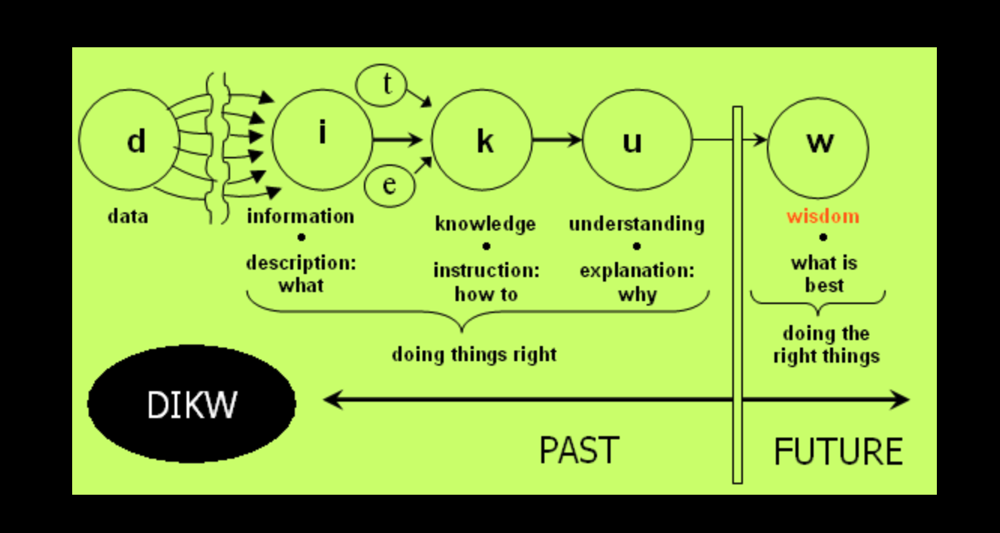
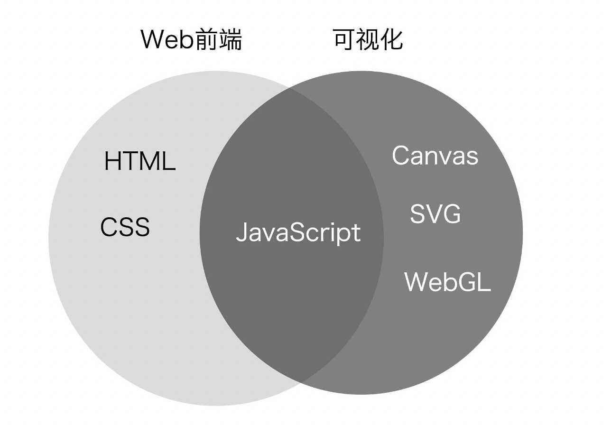
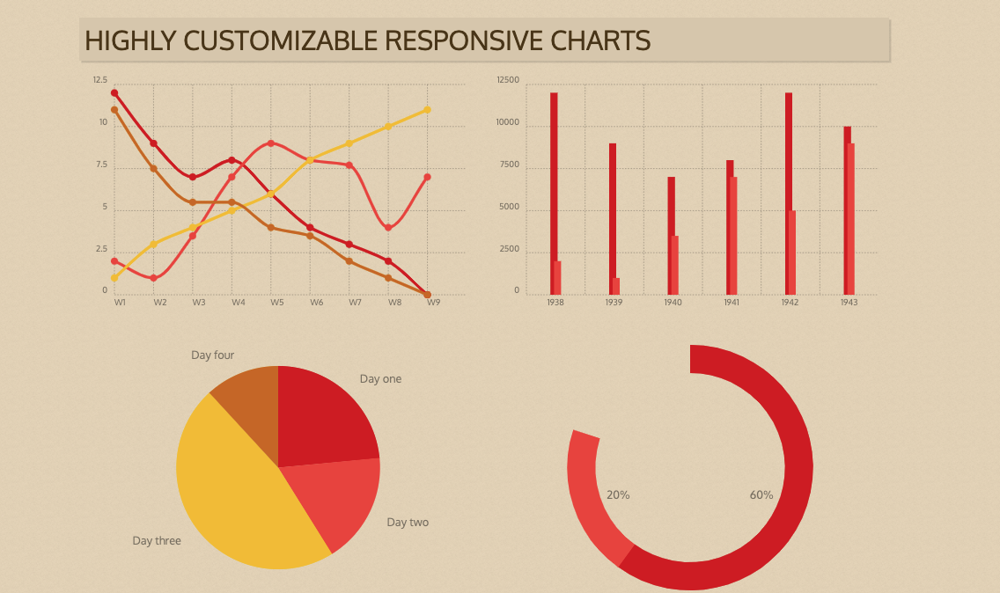
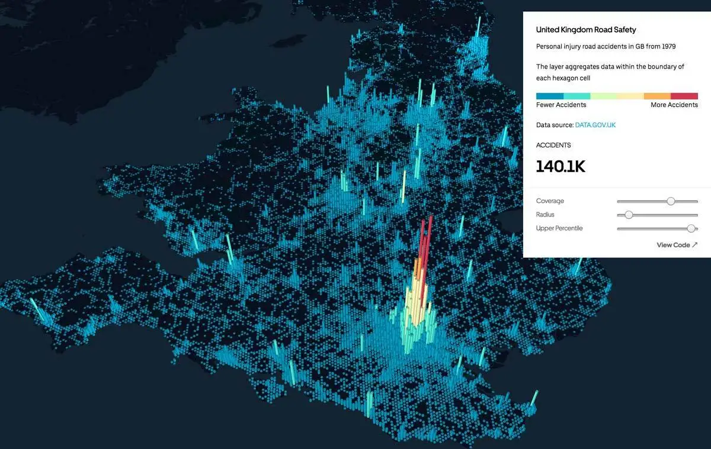
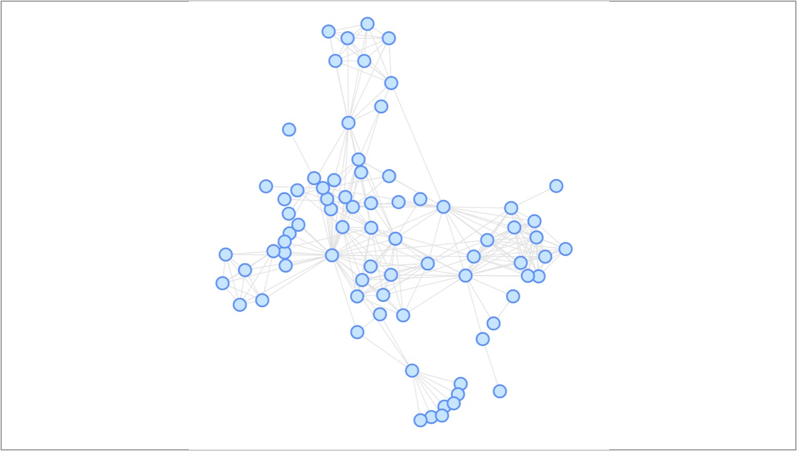
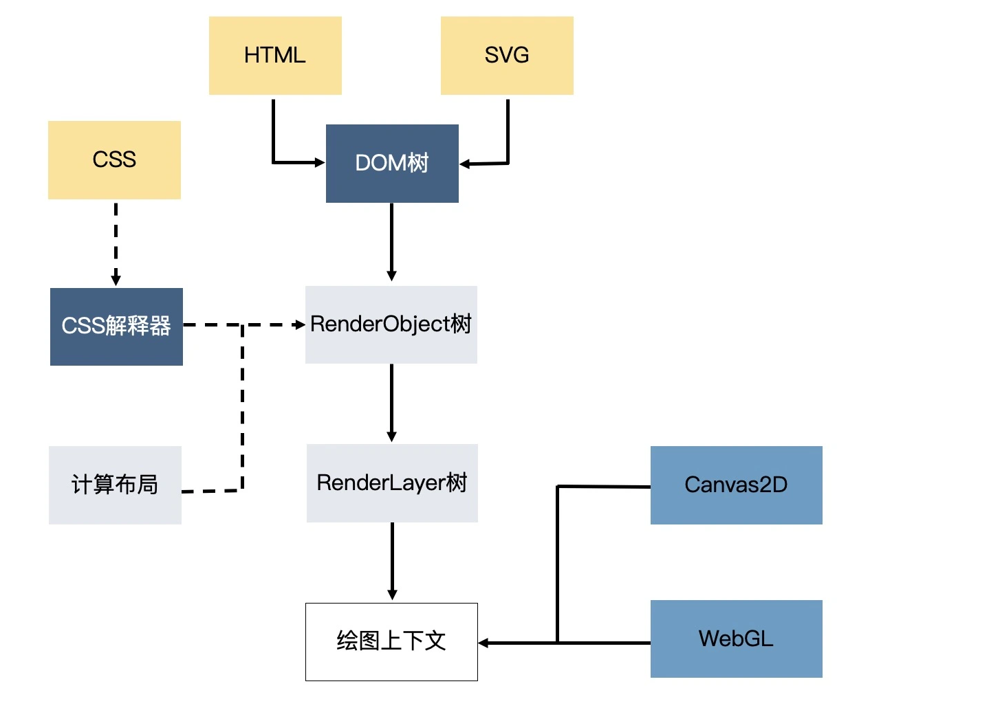
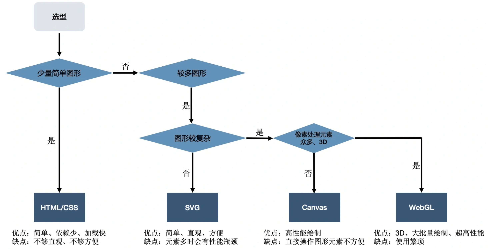
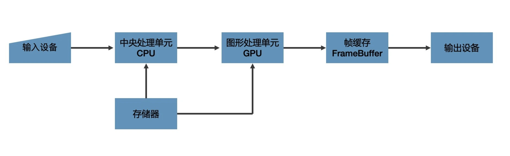
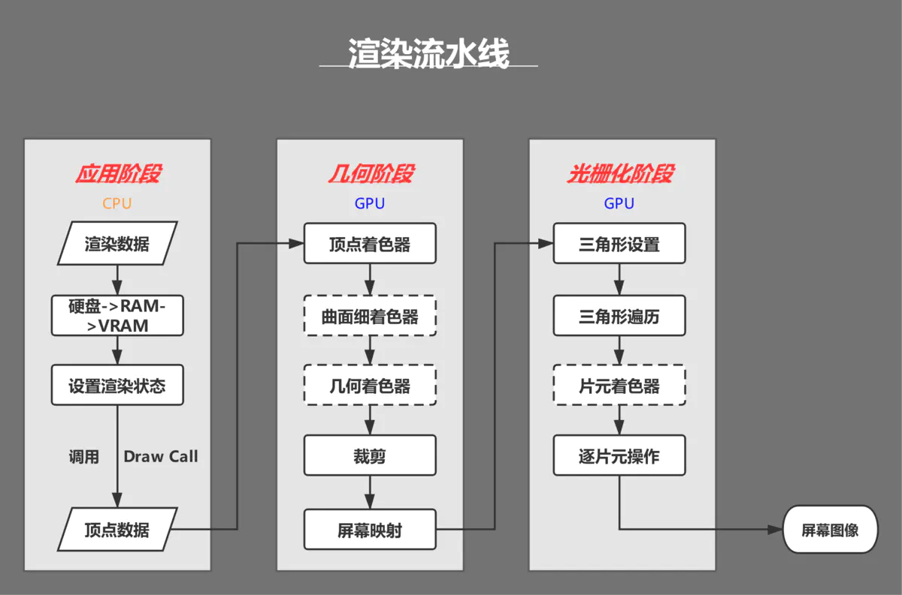

# 什么是可视化？《数据可视化 第2版》第一章读书笔记

## 概述

说到可视化，大家可能会想到表格、饼图、柱状图、三维大屏图、建筑图等等，或者会想到excel、matlab、echarts等工具，但可视化真的仅限于此吗？本章将从前端工程师的角度，结合《数据可视化》，对可视化的基础、架构以及选型做一次探讨。

## 数据可视化简介

**可视化的定义**
- 动词：生成符合人类感知的图像。
- 名词：使某物、某事可见的动作或事实。

**可视化的作用**
- 发现、决策、解释、分析、探索和学习。
- 通过可视化提高人们完成某些任务的效率。

**可视化简史**：略

说到数据可视化，不得不说到**数据科学**：DIKW模型

    D：Data，是对目标观察和记录的结果，数据本身是未经组织的、离散的、客观的观察。如：国家、生日、10月1日
    I：Information，信息是组织好的结构化数据，与某个特定目标和上下文有关联。如：国家的生日：10月1日
    K：Knowledge，知识是一个隐晦的、意会的、难以描述和定义的概念，是被处理过、组织过、应用或付诸行动的信息。比如国家的生日我们该做什么？（放7天假）
    W：Wisdom，智慧是启示性的，知道为什么，知道如何去做。在智慧和知识之间有一种状态：理解。比如：为什么会有国庆？为什么会有7天假？我们该做什么？

而这个模型，也是我们数据处理的标准流程，完成从原始数据的转化。

**数据可视化的意义**：用户通过对可视化的感知，使用可视化交互工具进行数据分析，获取知识，并进一步提升为智慧。

**数据可视化分类**
- 科学可视化：主要面向自然科学，如物理、化学、气象气候、航空航天、医学、生物等学科。研究的重点是带有空间坐标和几何信息的医学影像数据、三维空间信息测量数据、流体计算模拟数据等。核心问题是如何快速有效的呈现数据中包含的几何、拓补、形状特征和演化规律。
- 信息可视化：处理抽象的、非结构化数据集合（如文本、图表、层次结构、地图、软件、复杂系统等）。核心问题是处理高维数据可视化、数据间抽象关系的可视化、用户的敏捷交互和可视化有效性的评断。
- 可视化分析：是一门以可视交互界面为基础的分析推理科学。综合了图形学、数据挖掘和人机交互等技术。本质是可视化的完成机器智能和人脑智能的双向转换。如：tableau、graphic、万能表、s2

**数据可视化与其他学科领域的关系**
- 计算机图形学、人机交互：计算机图形学为可视化提供了编码和图形呈现的理论基础。在数据可视化中，通过人机界面实现用户的数据的理解和操纵，数据可视化的质量和效率也需要最终的用户评判，因此，数据、人、机器之间的交互是数据可视化的核心。
- 数据库与数据仓库：数据可视化通过数据的有效呈现，有助于对复杂关系和规则的理解。而大数据可视化方法中，就必须考虑新型的数据组织管理和数据仓库技术，因此是相辅相成的关系。
- 数据分析和数据挖掘：数据挖掘领域提出了可视化挖掘的方法，核心是将原始数据和数据挖掘的结果，用可视化方法呈现。配合人眼这个天生高带宽的巨量视觉并行处理器来达到挖掘效果。

**可视化方法与技术**：目前有生命科学可视化、表意性可视化、地理信息可视化、产品可视化、教育可视化、系统可视化、商业智能可视化、知识可视化等方法与技术，每一个名词都可以展开一篇巨大的篇幅，本篇只做一个概念梳理，读者可对其中感兴趣的方向做具体研究。

**设计数据可视化系统面临的挑战**
- 计算能力的可扩展性：由于有限的时间和存储资源，面向大数据的数据清洗、转换、布局和绘制算法的计算复杂度是主要关注对象。
- 感知和认知能力的局限性：人类的记忆容量和注意力是宝贵且有限的资源，比如人类在执行视觉搜索的时候，前几分钟的警觉性是远超于之后的时间的。
- 显示能力的局限性：屏幕的分辨率已经不能同时显示所有想表达的信息。为了尽可能多地显示以减少导航，但显示代价较高，用户也会产生视觉混乱，所以需要综合权衡。

## 前端领域的可视化

那Web前端和可视化到底有什么区别呢？

### 技术栈的区别：

### 领域与工具的区别：

众所周知，前端三剑客 html+css+js 即可解决 web 前端所有功能，而相关领域的 js 库目前最流行的莫过于 react、vue、angular 以及相对较古老的 jQuery，这些框架或者 js 库即可辅助你完成 web 前端所遇到的大部分需求，但可视化领域呢？

**统计数据图表库**：主要为统计数据做可视化展示，主要涉及柱状图、折线图、饼图等，目前开源图表库有 Plotly、G2、Echarts、Chartist、Chart.js 等。

**GIS地图库**：处理地图地理信息可视化相关的库。常见的有 L7、Mapbox、Leaflet、Deck.gl、CesiumJS 等。

**图可视化绘图库**：主要描述点边关系图，流程图等带有边概念的图。如 G6、cytoscape.js、mxGraph 等。

**通用渲染库**：绘制更加灵活的图形、图像或者物理模型，比如游戏模型、建筑模型、复杂图表等功能，当你在上述领域找不到对应工具时，即可选择此类 js 库，但灵活的同时带来的就是困难度的提升。主要有 Pixi.js、SpriteJS、P5.js、Rough.js、G、ThreeJS、D3.js 等。

### 可视化技术选型

首先浏览器实现可视化的方式目前有4种，分别是 HTML + CSS、SVG、Canvas2D、WebGL，其中 WebGL 利用了 GPU 并行处理的特性，在大数据场景下，性能大大优于前3种绘图方式。具体渲染流程如下：

**选型**

当然，Canvas 和 SVG 的对比不能简单看图形复杂度和性能，在强调操作的准确性以及对字体的清晰度要求较高的场景，或许你该从 SVG 下手。

### 结尾

最后，我再补充一些有关 CPU 和 GPU 交互的概念，从计算机角度看看如何渲染图形。

**图形是如何绘制的**

**渲染流程（渲染管线）**

参考资料：

《数据可视化》第2版 - 陈为、沈则潜、陶煜波 等编著

ps：本章节有部分图片是作者在以前做笔记的时候保存的，为了方便理解添加至文中。如有侵权，请联系作者删除，谢谢。

