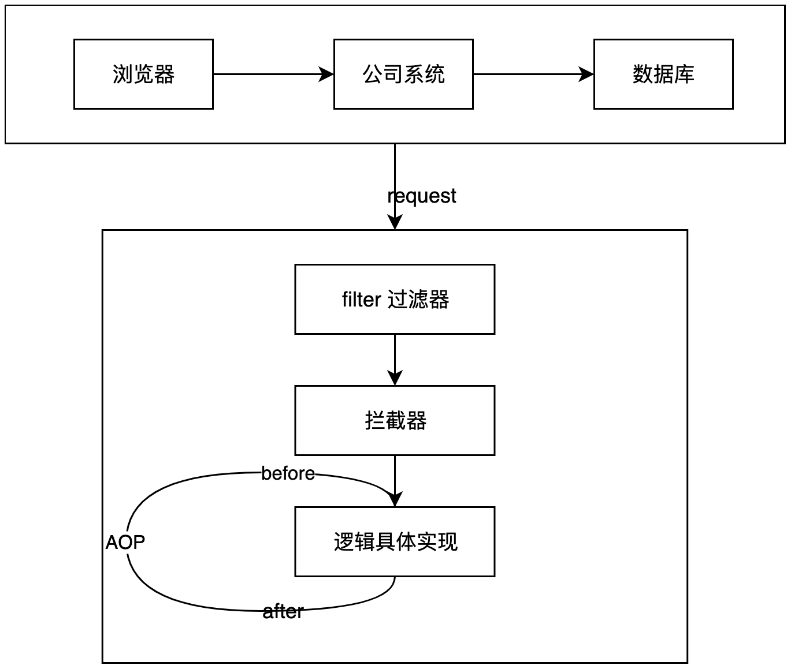
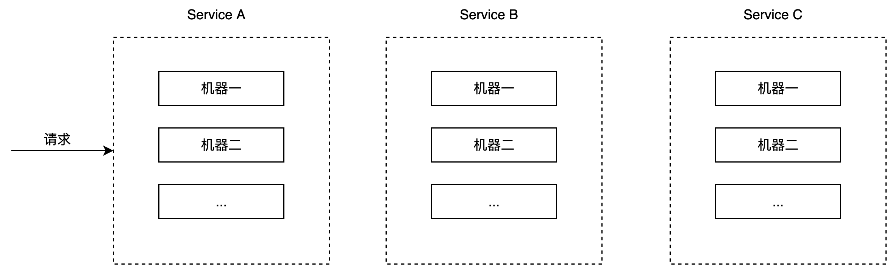
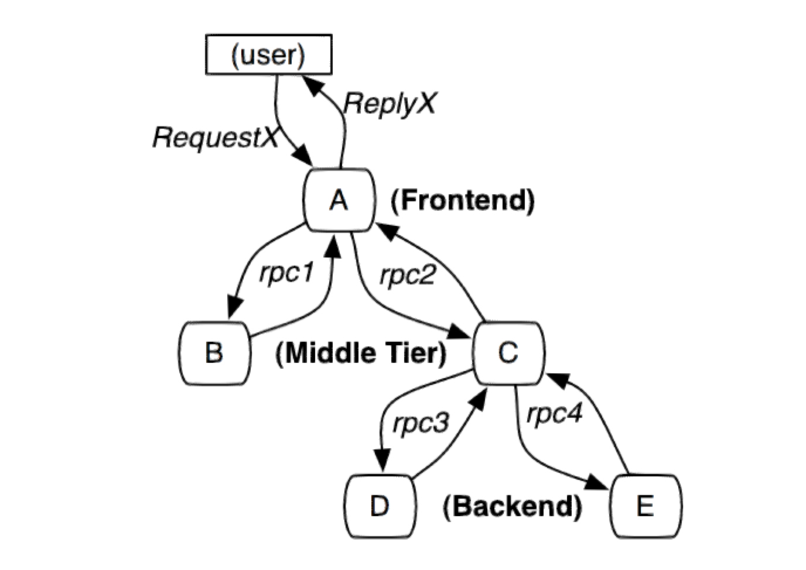
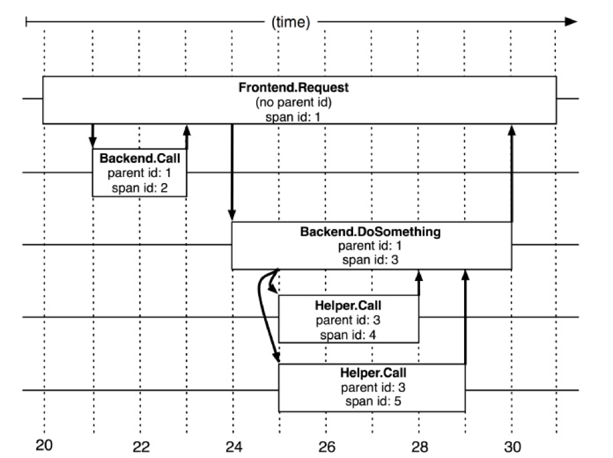
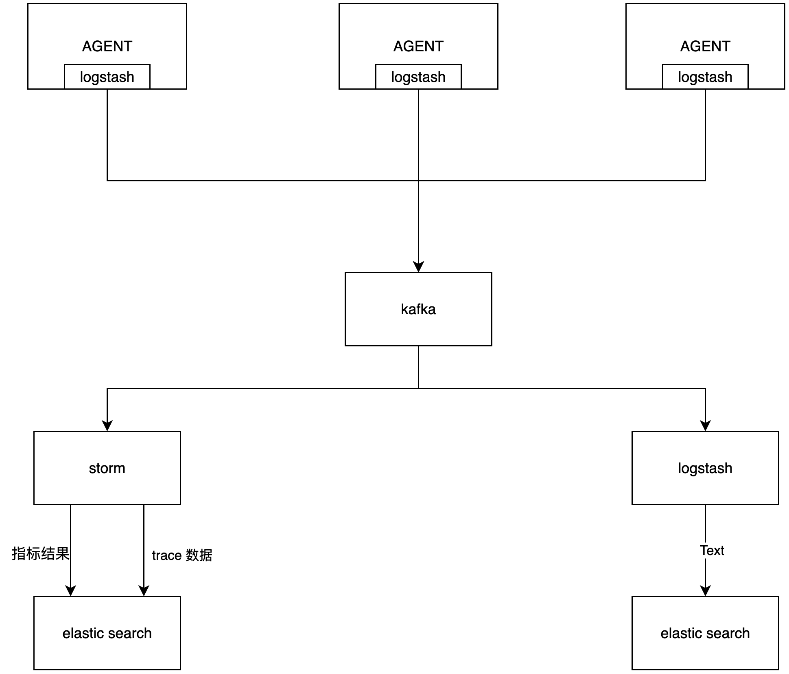
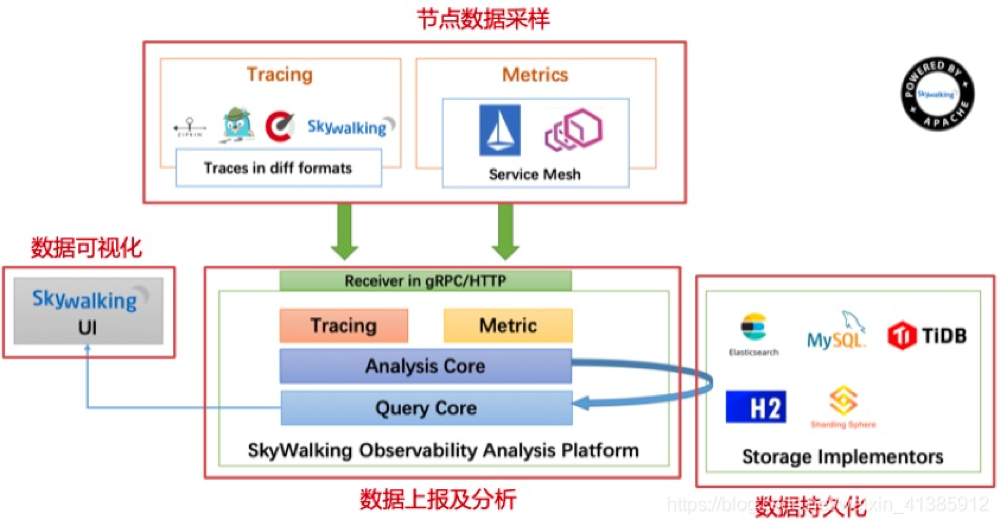
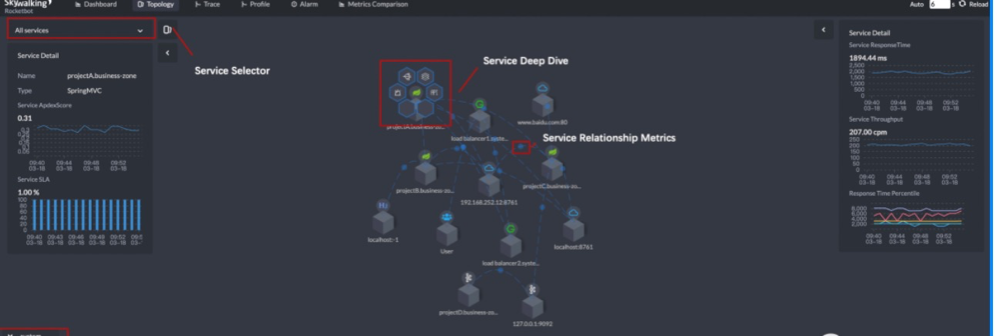

# 分布式全链路监控探索学习

## 一、背景

当代互联网的服务，通常都是用复杂的、大规模分布式集群实现的。互联网应用构建在不同的软件模块集中，这些软件模块，有可能是不同团队开发、可能使用不同的编程语言来实现、也有可能分布在了几千台服务器中，横跨多个不同的数据中心。因此，就需要一些可以帮助理解系统行为、用于分析性能问题的工具。

## 二、历程

举例：

假设我们想要知道一次接口请求的性能好坏，通常情况下，我们可以通过判断以下三个指标（Metrics）：

- 接口调用的时间（Request Time）;
- 是否有异常的响应，异常调用的次数的占比；
- 主要的耗时在哪个环节；

## **1.  单体框架**

一般单体框架会用于公司项目刚起步时，或者一些简单的项目。在单体框架下，我们最容易能够想到的是使用面向切面的设计模式（AOP）

- 使用 AOP 在调用具体的业务逻辑前后分别进行时间打点，然后计算其整体的耗时；
- 同时也可以使用 AOP 来 catch 住异常的情况，来判断整体的调用稳定性；

如下所示:



单体框架的不足：

- 单体应用在部署和运行时，需要单台服务器具有大量内存和其他资源，巨大的单体应用必须通过多个服务器上复制整个应用程序来实现横向扩展，扩展能力极差
- 所有复杂业务都集成在一个系统中，各个功能组件耦合紧密，使得维护和更新十分困难；

## **2.  微服务框架**

### 2.1 **微服务简介：**

微服务架构下，传统的巨大单体应用被拆分为小型模块化服务，每项服务都围绕着特定的业务领域构建，微服务组织更好、更小、耦合更松散，并且支持独立开发、测试和部署。所以微服务更小且无状态，因此更容易扩展；

### **2.2  微服务的优势：**

微服务的优势：

1. 复杂度可控；
2. 独立部署；
3. 技术选型灵活；
4. 故障隔离，容错率高；
5. 利于扩展；
6. 功能逻辑内聚；

微服务存在挑战：

1. 固有的复杂性：微服务应用是分布式系统，因此在切换时存在固有的复杂性；
2. 分区的数据库架构；
3. **波及多个服务**

在单体架构中，由于所有的服务、组件都是部署在同一台机器上的，对于不同的指标获取来说相对比较容易实现，但是如果拆分到微服务的框架中，会变得更加复杂和难以定位追踪：

如果有用户反馈某个页面很慢，我们已经知道这个页面的请求调用链是  A ---> B ---> C ---> D，此时如何定位可能是哪个模块引起的问题。每个服务  Service A,B,C,D  都有好几台机器。怎么知道某个请求调用了服务的具体哪台机器呢？



此时我们可以看到，由于无法准确定位每个请求经过的确切路径，在微服务这种框架下存在一下痛点，对应着微服务挑战中的第三项，**波及多个系统，会导致以下几个问题**：

1. 排查问题难度大，周期较长；
2. 特定场景难以复现；
3. 系统性能瓶颈难以分析；

所以大规模分布式系统的跟踪系统应运而生，它主要的作用在于：

1. 自动采取数据
2. 分析数据产生完整的调用链：有了完整的调用链之后，问题能有很大概率能够复现；
3. 数据可视化：每个组件的性能可视化，能帮助我们很好的定位系统的瓶颈，及时找出问题所在；

## 三、分布式追踪系统

2010 年 4 月，谷歌发布了一篇论文《Dapper，  大规模分布式系统的跟踪系统》，介绍了分布式追踪的概念，然后基于谷歌的提出的分布式的概念，OpenTracing  定义了一个开放的分布式追踪标准，这样的话 OpenTracing 通过提供平台无关、厂商无关的 API，使得开发人员能够方便地添加追踪系统的实现；

现代的分布式追踪框架都是参考于 Google 的 Dapper（大规模分布式系统的追踪系统）来做的。通过分布式追踪系统能够很好地定位如下请求联路，从而轻易地实现请求链路追踪，每个模块的瓶颈定位和分析。

## **1. Google Dapper  系统概述**

### **1.1  调用示例**



上图是一个和 5 台服务器相关的一个服务，包括前端（A），两个中间层（B 和 C），以及两个后端服务（D 和 E）。

此时当用户在前端界面中发起一个请求时，前端应用发送两个 RPC（这里的 RPC 理解成不同服务之间的通信方式）到服务器 B 和 C。如图所示，B 会马上做出反应，但是 C 需要和后端的 D 和 E 交互之后再返回给 A，由 A 来响应最初的用户请求。

对于这样的一个请求，简单实用的分布式跟踪的实现，就是为服务器上每一次发送和接收动作来收集跟踪标识符和时间戳。

为了将所有的记录条目和特定的发起者关联并且记录所有的信息，Google Dapper 采用了**基于标注（annotation-based）的方案**，**依赖于应用程序或者中间件明确地标记一个全局 ID，通过这个全局 ID 来链接每一条记录和发起者的请求。**

### **1.2 OpenTracing 的概念**

- Trace(跟踪)：可以将一个完整请求链路是作为一个跟踪。
- Span(跨度)：请求链路中一次服务调用的完整过程称为一个跨度（有开始时间和结束时间）
- Span Context：Trace 的全局上下文信息，里面包含许多标注信息，如 traceId 等；

### **1.2.1 Trace 和 Span 的关系**

树状图展示：

```
一个tracer过程中，各span的关系

        [Span A]  ←←←(the root span)
            |
     +------+------+
     |             |
 [Span B]      [Span C] ←←←(Span C 是 Span A 的孩子节点, ChildOf)
     |             |
 [Span D]      +---+-------+
               |           |
           [Span E]    [Span F] >>> [Span G] >>> [Span H]
                                       ↑
                                       ↑
                                       ↑
                         (Span G 在 Span F 后被调用, FollowsFrom)
```

时序图展示：

```
上述tracer与span的时间轴关系

––|–––––––|–––––––|–––––––|–––––––|–––––––|–––––––|–––––––|–> time

 [Span A···················································]
   [Span B··············································]
      [Span D··········································]
    [Span C········································]
         [Span E·······]        [Span F··] [Span G··] [Span H··]
```

可以在上面的两张图中看出，trace 并不是一个实体的概念，它是一个潜在的，拥有多个 span 并行的系统；

而一个 span 代表系统中具有开始时间和执行时长的逻辑运行单元。span 之间通过嵌套或者顺序排列建立逻辑因果关系。

### 1.2.2 Span Context

每个 span 必须提供方法访问 SpanContext。SpanContext 代表跨越进程边界，传递到下级 span 的状态。SpanContext 在跨越进程边界，和在追踪图中创建边界的时候会使用。在 spanContext 对象中存在一个 Baggage 属性，他会在一条追踪链路上所有的 span 内全局传输，内容包含这些 span 对应的 spanContext。所以在下级 span 中，可以获取到上级的内容状态包括 trace_id、上级的 span_id 等；这样不同层级的 span 可以形成一棵跟踪树



**调用示例中的整体追踪过程:**

1. 请求到来生成一个全局 TraceID，通过 TraceID 可以串联起整个调用链，一个 TraceID 代表一次请求。
2. 除了 TraceID 外，还需要 SpanID 用于记录调用父子关系。每个服务会记录下 parent id 和 span id，通过他们可以组织一次完整调用链的父子关系。
3. 一个没有 parent id 的 span 成为 root span，可以看成调用链入口。
4. 整个调用过程中 span 可以通过 spanContext 获取父级的上下文信息作为 parent id 记录下，并且将自己生成的 SpanID 也记录下。
5. 查看某次完整的调用则   只要根据 TraceID 查出所有调用记录，然后通过 parent id 和 span id 组织起整个调用父子关系。

**阶段总结：**

1. **依赖于一个全局 ID，通过这个全局 ID 来链接每一条记录和发起者的请求，是这个系统的核心；**
2. **一个完整的 trace 是包含多个 span 的一个潜在的、并行的系统；**
3. **span 是一个**具有开始时间和执行时长的逻辑运行单元，span 之间可以嵌套或者顺序排列；
4. OpenTracing 标准规定，span 必须能够提供方法让外部访问 SpanContext，可以跨域进程的边界，用于构建追踪树；
5. 一个依赖全局 ID，并且能形成结构化的 span 数据，是构成一个分布式追踪系统的必要组成要素。
6. OpenTracing 标准还做了很多针对  trace、span 的 API 定义；

### **1.3 Dapper  调用链的核心工作**

1. **调用链数据生成**，对整个调用过程的所有应用进行埋点并输出日志。
2. **调用链数据采集**，对各个应用中的日志数据进行采集。
3. **调用链数据存储及查询**，对采集到的数据进行存储，由于日志数据量一般都很大，不仅要能对其存储，还需要能提供快速查询。
4. **指标运算、存储及查询**，对采集到的日志数据进行各种指标运算，将运算结果保存起来。
5. **告警功能**，提供各种阀值警告功能。

### **1.4 Dapper  整体架构**



1. 通过 AGENT 代理生成调用链日志。
2. 通过 logstash 采集日志到 kafka。
3. kafka 负责提供数据给下游消费。
4. storm 计算汇聚指标结果并落到 es。
5. storm 抽取 trace 数据并落到 es，这是为了提供比较复杂的查询。
6. logstash 将 kafka 原始数据拉取到 hbase 中。

## **2. Skywalking**

skywalking 是借鉴 Dapper 的理论模型实现的，是**国产**的优秀 APM 组件，是一个对 JAVA 分布式应用程序集群的业务运行情况进行追踪、告警和分析的系统。

### **2.1  基础架构**

SkyWalking  的基础如下架构，可以说几乎所有的的分布式调用都是由以下几个组件组成的



首先是节点数据的定时采样，采样后将数据定时上报，将其存储到  ES, MySQL 等持久化层，有了数据自然而然可根据数据做可视化分析。

### **2.1  增强**

skywalking 针对 dapper 的实现在以下几个方面做了增强:

1. 探针的性能
2. collector 的可扩展性
3. 全面的调用链路数据分析
4. 对于开发透明，容易开关
5. 完整的调用链应用拓扑



# **四、Sentry  与  Skywalking  的比较**

1. 侧重点不同：

setnry 是一个实时事件的**日志聚合平台**，**专门检测错误并提取有用的信息用于分析**，可以不让我们依赖于用户反馈来进行问题定位。他可以覆盖大部分的主流变成语言和框架，很适合应用到实际的生产环境中去**采集异常日志**。是一个对前端异常排查友好型的监控平台。

而 skywalking 是一个对 JAVA 分布式应用程序集群的业务运行情况进行追踪、告警和分析的系统。主要是针对服务端整体链路的排查；

Sentry 的全链路追溯也是为了更方便前端的错误问题定位和排查，并没有设计到更多的业务运行情况的追踪和分析，所以 sentry 的 trace 数据也并没有按照 OpenTracing 标准来设计；

1. skywalking 的前端监控需求对比

| 需求定义                            | 需求程度 | 是否满足                                                                                                     |
| ----------------------------------- | -------- | ------------------------------------------------------------------------------------------------------------ |
| 1. 错误追溯和告警机制               | ★★★★★    | 不太满足，虽然支持异常监控，但是仅返回错误堆栈信息（可结合 sourcemap，待验证），缺少错误发生时的上下文信息。 |
| 2. 接口性能和稳定性监控（性能监控） | ★★★★     | ✅ 满足大部分的指标查询                                                                                      |
| 3. 自定义数据上报（数据监控）       | ★★★      | ✅ 满足                                                                                                      |
| 4. 私有化部署                       | ★★★★     | ✅ 满足                                                                                                      |
| 5. 支持多版本多应用                 | ★★       | ✅ 满足                                                                                                      |
| 6. 良好的监控结果可视化展示         | ★★       | ✅ 满足，但较为简略                                                                                          |

2. 部署机器相关的比较：

sentry  需要部署的相关服务：

- sentry-data
- sentry-postgres
- sentry-redis
- sentry-zookeeper
- sentry-kafka
- sentry-clickhouse
- sentry-symbolicator

skywalking  部署需要的相关服务：

- skywalking-ui
- skywalking-oap-server
- elasticsearch:7.12.1

# **五、实践方案**

1. 因为在 skywalking 中缺少错误发生时的上下文信息，针对前端应用在发生错误时，触发异常上报的同时，携带自定义的上下文信息一起上报，待实践；
2. 同时启用 sentry+skywalking，对于 sentry 进行一定程度的阉割，或者参考 sentry + openTelemetry  全链路的打通，但是又会丢失 skywalking 的部分增强功能；

[参考网上的使用 sentry + OpenTelemetry 全链路的打通](https://yeqown.xyz/2021/12/15/Sentry-OpenTelemetry%E5%89%8D%E5%90%8E%E7%AB%AF%E5%85%A8%E9%93%BE%E8%B7%AF%E6%89%93%E9%80%9A%E6%80%BB%E7%BB%93/#sentry%E4%BD%9C%E4%B8%BA%E9%93%BE%E8%B7%AF%E9%87%87%E9%9B%86%E7%BB%84%E4%BB%B6%E7%9A%84%E4%BC%98%E7%BC%BA%E7%82%B9)

了解日志的实效性、日志上报的体量；

无法复现的问题在监控平台的追踪是否可行，判断监控平台的能力边界；

构建错误场景，进行覆盖测试；

参考文档：

[https://wu-sheng.gitbooks.io/opentracing-io/content/pages/spec.html](https://wu-sheng.gitbooks.io/opentracing-io/content/pages/spec.html) opentracing  文档中文版

[https://bigbully.github.io/Dapper-translation/](https://bigbully.github.io/Dapper-translation/) 《Dapper，  大规模分布式系统的跟踪系统》

[https://juejin.cn/post/6844903560732213261#heading-4](https://juejin.cn/post/6844903560732213261#heading-4) 《全链路监控（一）：方案概述与比较》
