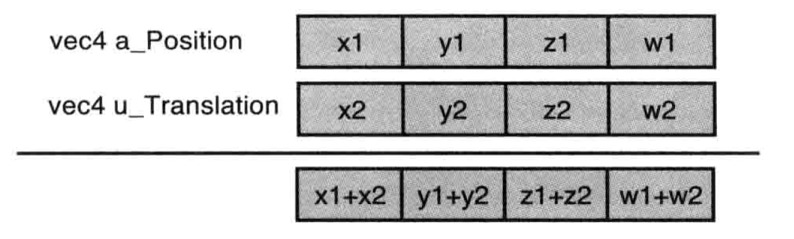
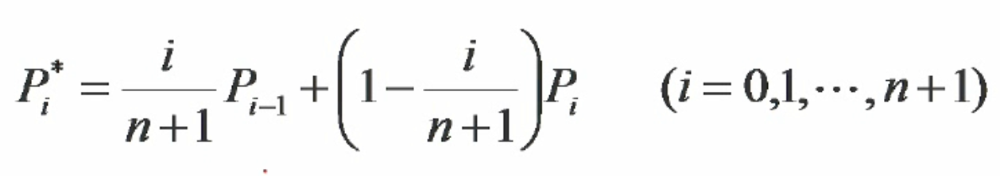

## 内容介绍

1. 向量
2. 常用矩阵及推演过程
3. 曲线-贝塞尔曲线的背景以及数学原理

## 一、向量

> 资料：
>
> - [向量加减](https://baike.baidu.com/item/%E5%90%91%E9%87%8F%E5%8A%A0%E5%87%8F/9575773)
>
> - [点乘与叉乘的概念几何意义](https://zhuanlan.zhihu.com/p/359975221)

**向量加减**：向量对应分量的加减

**向量点乘**：求夹角，判断方向，是否垂直

**向量叉乘**：计算四边形的面积，计算垂直于平面的法线向量

## 二、矩阵

常见的图形学中所涉及到的矩阵：

1. 平移矩阵
2. 旋转矩阵
3. 缩放矩阵
4. 镜像矩阵
5. 投影矩阵

涉及到坐标变换的矩阵：

1. 模型矩阵
2. 视图矩阵
3. 投影矩阵

### 2.1 移动

### 2.2 旋转

1. 旋转轴
2. 旋转方向
3. 旋转角度

根据三角函数两角和公式：

得：

带入上述公式消除后得：

### 2.3 变换矩阵

矩阵不符合交换律： A * B  不等于 B * A

#### 2.3.1 平移矩阵（translation matrix）

由于有常量，Tx、Ty、Tz 无法用3 x 3的矩阵表示，所以需要4 x 4的矩阵以及具有第四个分量的矢量

将数学表达式与矩阵等式对比后得到最终的平移矩阵：

#### 2.3.2 旋转矩阵（rotation matrix）

矩阵等式：

数学表达式：

假设a = cos β，b = -sinβ，c = 0，d = 0;

假设e = sin β，f = cos β，g = 0，d = 0;

假设i= 0，j = 0, k = 1, d = 0;

假设m = 0，n = 0，o = 0， p = 1；

则得出：

#### 2.3.3 缩放矩阵（Scaling Matrix）

#### 2.3.4 高级变换

矩阵乘法

A x B得：

变换顺序不同，得到的结果不同：

#### 2.3.5 复合矩阵

// TODO

## 三、曲线

### 3.1 贝塞尔曲线

#### 3.1.1 背景

> 给定n+1个数据点，p0(x0,y0),...pn(xn,yn)，生成一条曲线，使得该曲线与这些点所描述的形状相符合

方式1： 插值-通过所有数据点

方式2： 逼近-逼近所有数据点

提到逼近算法，我们首先能想到的就是**[多项式曲线拟合](https://zhuanlan.zhihu.com/p/366870301)**，但是它有个明显的缺陷，就是**曲线震荡**。

因此，法国的工程师[皮埃尔·贝塞尔](https://baike.baidu.com/item/皮埃尔·贝塞尔/6134119?fromModule=lemma_inlink)（Pierre Bézier）在1962年发表了贝塞尔曲线，当时他主要用来给汽车的主体外形进行设计。

贝塞尔基函数是这样的：

1972年，Forrest发表著名论文，证明该**贝塞尔函数**可以简化成**伯恩斯坦基函数（Bernstein）**。

> 资料：[伯恩斯坦多项式](https://blog.csdn.net/TYILY/article/details/116455436)
>
> 资料：[Bernstein Polynomial - wiki](https://en.wikipedia.org/wiki/Bernstein_polynomial) 

后面则一直用**伯恩斯坦基函数**来取代**贝塞尔基函数**

但是，Paul de Casteljau于1959年运用de Casteljau演算法开发，以稳定数值的方法求出贝赛尔曲线，却是最高效的，一直沿用至今。

**牛顿二项式定理**

> 给出两个数之和的整数次幂的恒等式

1980年，北京航空学院  施法中  发表了论文《Bezier基函数的导出》。

#### 3.1.2 一次贝塞尔曲线

推算出为连接起点P0到终点P1的直线段。

#### 3.1.3 二次贝塞尔曲线

矩阵形式：

#### 3.1.4 三次贝塞尔曲线

矩阵：

#### 3.1.5 贝塞尔曲线性质

1. 端点性质：只通过P0，Pn

2. 一阶导数：走向始终一致

3. 几何不变性：几何特性不随坐标变换而变化，与坐标系无关

4. 变差缩减性：若贝塞尔曲线的特征多边形是一个平面图形，则平面内的任意直线与p(t)的交点个数**不多于**该直线与其特征多边形的交点个数，说明贝塞尔曲线的波动小，更顺滑

   

#### 3.1.6 贝塞尔曲线的生成方式

1. 根据伯恩斯坦基函数生成： 计算量过大

   1. 递推计算式：

      

   

   2. 分量坐标形式：

      

   

2. de Casteljau算法（计算贝塞尔曲线的标准算法）

   > 资料：[德卡斯特里奥算法 De Casteljau's algorithm](https://zh.m.wikipedia.org/zh-hans/%E5%BE%B7%E5%8D%A1%E6%96%AF%E7%89%B9%E9%87%8C%E5%A5%A5%E7%AE%97%E6%B3%95)

   

根据二项式性质，将贝塞尔曲线的显示表达式转化为递推表达式，如下：

#### 3.1.7 贝塞尔曲线的拼接

1. G0连续： P3 = Q0
2. G1连续，三点共线：Pn-1，Pn=Q0，Q1

#### 3.1.8 贝塞尔曲线的升阶与降阶

> 资料：[Bezier曲线之升阶和降阶公式](https://blog.csdn.net/mw_1422102031/article/details/109392080)

升阶：

降阶：（不精确）

### 3.2 B样条曲线

// TODO

## 四、参考文档及学习资料

- [线性代数的本质](https://www.bilibili.com/video/BV1ib411t7YR?p=1&vd_source=5464488df12250c6d67a43b4a176a012)
- [多项式拟合的介绍与例子](https://zhuanlan.zhihu.com/p/366870301)
- [伯恩斯坦多项式](https://blog.csdn.net/TYILY/article/details/116455436)
- [Bernstein Polynomial - wiki](https://en.wikipedia.org/wiki/Bernstein_polynomial) 
- [德卡斯特里奥算法 De Casteljau's algorithm](https://zh.m.wikipedia.org/zh-hans/%E5%BE%B7%E5%8D%A1%E6%96%AF%E7%89%B9%E9%87%8C%E5%A5%A5%E7%AE%97%E6%B3%95)
- [A Primer on Bézier Curves（强推）](https://pomax.github.io/bezierinfo/index.html)
- [Bezier曲线之升阶和降阶公式](https://blog.csdn.net/mw_1422102031/article/details/109392080)

