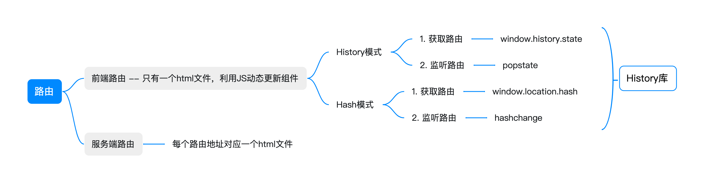
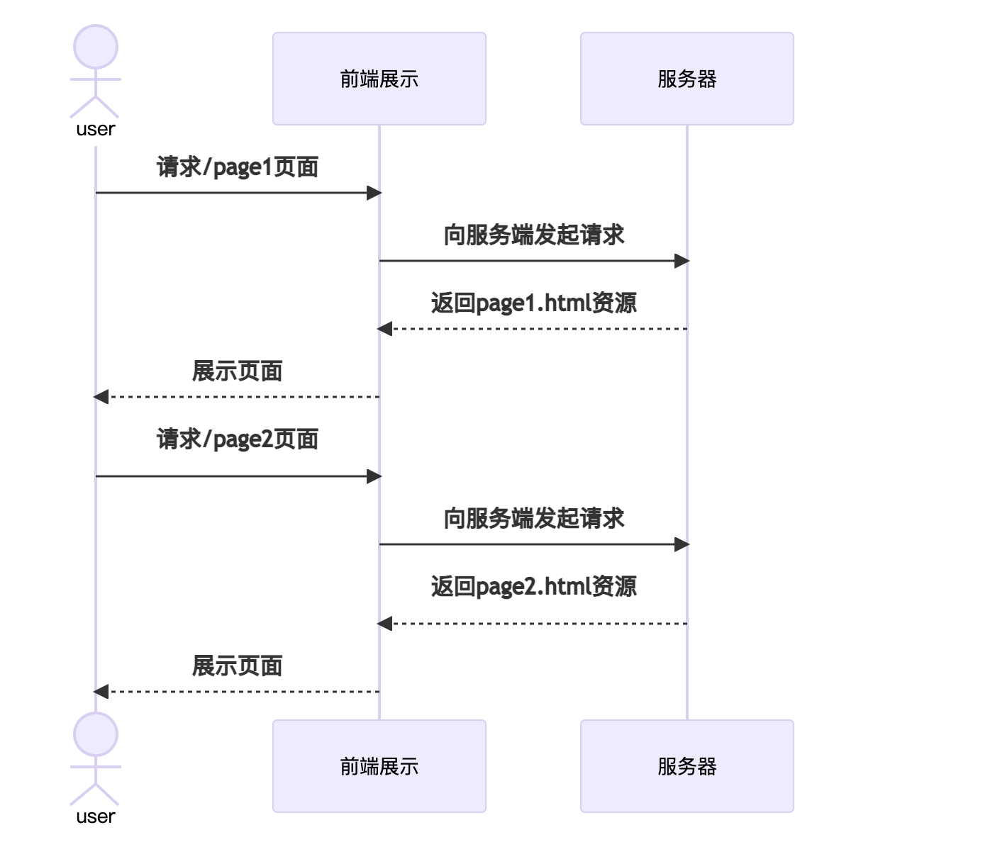
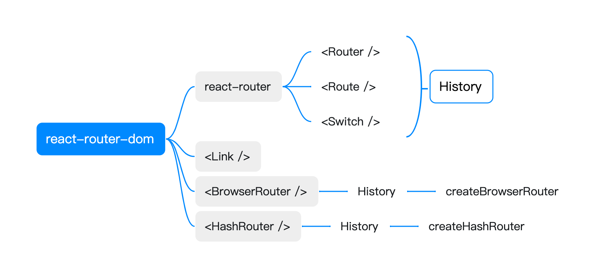
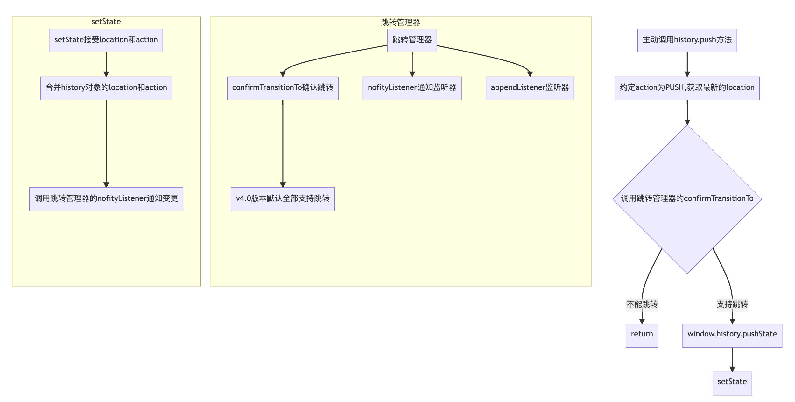
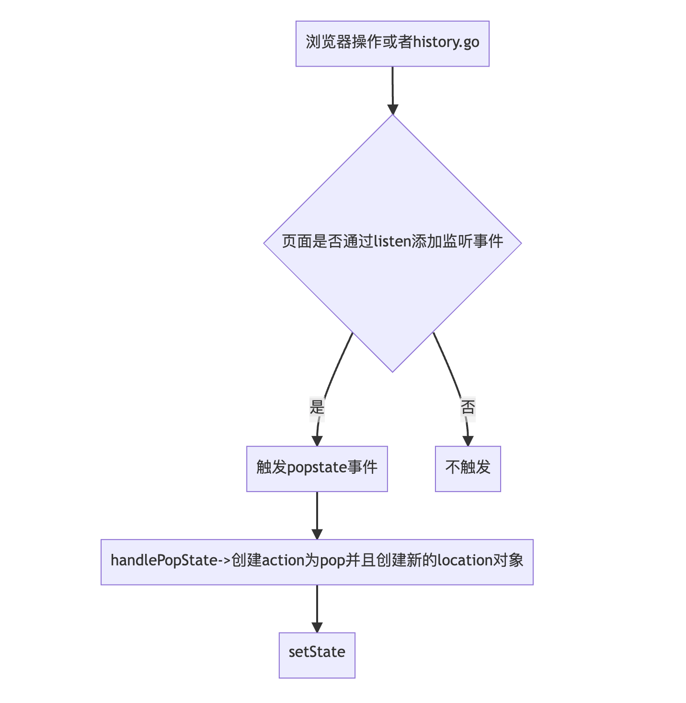
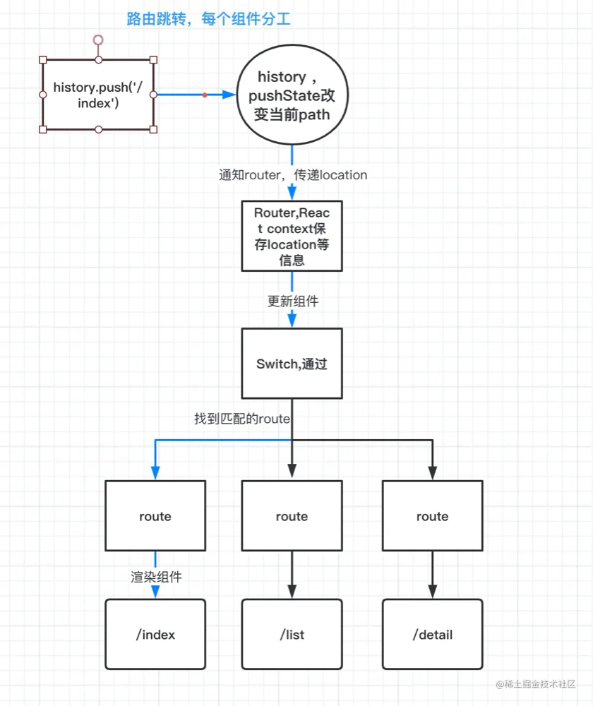

# 前端路由

## **目录**

1.  传统路由和前端路由

- 1.1  什么是传统页面
- 1.2  什么是 SPA（为什么会出现
- 1.3  什么是前端路由

  2.  如何实现前端路由

- 2.1 Hash 模式
- 2.2 History 模式
- 2.3  两者的优缺点对比

  3.  探究 History 库

  4. React-Router 源码探查

  5. umi-router

---

首先先看下整体的整体的 xmind 思维导图：



## **1.  传统路由和前端路由**

### **1.1  什么是传统路由：**

也可以叫做后端路由，简单来理解，在传统的网站设计中，每个 HTML 文件都是一个完整的页面，涵盖了全部的 HTML 结构。当我们访问某一个具体的网址的时候，实际上访问的是与这个网址相对应的一个 HTML 文件，该文件又会加载自己依赖的资源，然后组成一个新的页面。如图所示：




这样的方式更像是页面流，所有的页面相当于一个一个文档组成，前端只负责处理展示，不存在数据和管理状态的概念；然后后端直接根据数据库的一些数据按照模板进行 html 的拼接。数据的更新就是文档的更新，这样的模式叫做 Java Server Pages（JSP）。存在的问题：

- 页面切换都需要刷新页面，会产生白屏的现象；
- 模块之间很难相互共享状态；
- 前后端不容易分离；

随着前端框架的成熟和稳定以及 Ajax 技术的不断发展、前后端的分离已经是当前架构开发的主流模式，所以 JSP 的开发模式已经辉煌不再了。

### **1.2  什么是 SPA:**

之前的 JSP，的 P 指的是 page，一个页面相当于一个文档；SPA 的全称叫做 single page web application，单页网页应用，越来越趋向于把页面做成一个应用。而在一个应用中，不会有路由的概念。而我们这个应用是内置在浏览器中，浏览器的地址栏的存在为一个前端单页应用提供了一个访问途径，也是各个应用的入口。

单页网页应用的出现大大提高了  WEB  应用的交互体验。在与用户的交互过程中，不再需要重新刷新页面，获取数据也是通过  Ajax 异步获取，页面显示变的更加流畅。

### **1.3  前端路由**

是在保证只有一个 HTML 页面的前提下，为应用内的每个视图都匹配一个特殊的 URL，在页面刷新、前进、后退都能够通过这个特殊的 URL 来实现。他的实质是，通过 js 动态渲染页面的内容。


## **2.  如何实现前端路由**

要实现上述的这个目标，我们需要做到两点:

- 改变浏览器中的 url 不会让浏览器向服务器发送资源请求；
- 可以监听到 url 的变化

目前有两种主流的方式:

1. hash 模式
2. history 模式

### **2.1  利用 hash 模式实现前端路由**

hash 指的是 url 后面的#号后面的字符，如[http://devdws.aloudata.work/#/userInfo](http://devdws.aloudata.work/#/userInfo)，后面的/userInfo 就是我们设定的 hash 值。

**利用 hash 模式天然可以实现前端路由:**

- hash 值的变化不会导致浏览器向服务器发送请求
- hash 的改变会触发 hashchange 事件，可以支持我们去监听
- 浏览器的前进后退也能对其进行控制

**核心实现逻辑**:

1. 通过创建一个路由对象 routers，记录每个 hash 值对应的页面渲染方法；
2. 监听 hashchange 事件，然后通过 routers[newHash]去执行页面的渲染方法；
3. 添加使用者手动注册视图的方法；

**核心 API**：

- window.location.hash = 'new hash' //  用于设置 hash 值
- let hash = window.location.hash //  获取当前 hash 值
- window.addEventListener('hashchange', function(event) {

let newURL = event.newURL;

let oldURL = event.oldURL

}, false)

代码如下:

```
// JS
class HashRouter {
  constructor() {
    //用于存储不同hash值对应的回调函数
    this.routers = {};
    window.addEventListener('hashchange', this.load, false)
  }

  //用于注册每个视图
  register(hash, callback = function () { }) {
    this.routers[hash] = callback;
  }

  //用于调用不同视图的回调函数
  load() {
    let hash = window.location.hash.slice(1),
      handler;
    if (hash) {
      handler = this.routers[hash];
      //执行注册的回调函数
    	handler();
    }
  }
}

//HTML
<body>
    <div id="nav">
        <a href="#/page1">page1</a>
        <a href="#/page2">page2</a>
        <a href="#/page3">page3</a>
    </div>
    <div id="container"></div>
</body>

<script>
	let router = new HashRouter();
	let container = document.getElementById('container');

	//注册首页回调函数
	router.registerIndex(()=> container.innerHTML = '我是首页');

	//注册其他视图回到函数
	router.register('/page1',()=> container.innerHTML = '我是page1');
	router.register('/page2',()=> container.innerHTML = '我是page2');
	router.register('/page3',()=> container.innerHTML = '我是page3');

	//加载视图
	router.load();
</script>
```

### **2.2 history 模式**

在 HTML5 之前，浏览器已经有了 history 对象，但在早期的 history 中只能用于**多页面**的跳转:

- history.go(-1); //  后退一页
- history.forward(); //  前进一页
- history.back(); //  后退一页

HTML5 版本出现之后，针对 history 新增了一下几个 API：

- history.pushState(); //  添加新的状态到历史状态栈
- history.replaceState(); //  用新的状态代替当前状态
- history.state; //  返回当前状态对象

因为 pushState 和 replaceState 都能在改变 url 的同时不会刷新页面，所以在 HTML5 中的 history 具备了实现前端路由的能力。

### **pushState 和 replaceState 的异同：**

- 相同点：
  - 两者都可以接受三个参数
    - state:  一个合法的 js 对象，可以用在 popstate 事件中
    - title：设置当前页面的标题，但是被大多数浏览器忽略，可用 null 代替
    - url：任意有效的 URL，用于更新浏览器的地址栏
  - **两者都可以改变地址栏的 url，并且不会向服务端发起请求**
- 不同点
  - pushState 在保留现有历史记录的同时，将 url 追加到历史记录中，历史记录长度+1
  - repalceState 会将历史记录中的当前页面替换为传入的 url，历史记录长度不变

popstate 事件是当同一个文档的浏览历史，即 history 对象出现变化时，会触发 popstate 事件；pushState 或者 replaceState 并不会触发该事件，只有用户点击浏览器倒退按钮和前进按钮，或者使用 go、back、forward 方法时才会触发。

相较于 hash 路由，在 hash 变化时，可以通过 hashchange 事件来监听到页面的变化，但是在 history 模式中，history 模式的路由变化并不会触发任何事件，所以我们**很难直接监听 history 的路由改变**。

所以我们可以换一个思路：

枚举 history 对象改变的情况，然后根据这些引发改变的方式进行一一手动更新：

1. 点击浏览器的前进或者后退  => history 对象改变  => popstate
2. 点击 a 标签  =>  阻止默认行为，使用 history.pushState
3. 在 JS 代码中触发 history.pushState、replaceState =>  主动更新

```
class HistoryRouter {
  constructor() {
    this.routers = {};
    // 在初始化时监听popstate事件
    this.bindPopState();
    this.listenLink();
  }

  register(path, callback = function () { }) {
    this.routers[path] = callback;
  }

  push(path) {
    window.history.pushState({ path: path }, '', path);
    if (this.routers[path]) {
      this.routers[path]()
    }
  }

  replace(path) {
    window.history.replaceState({ path: path }, '', path);
    if (this.routers[path]) {
      this.routers[path]()
    }
  }

  bindPopState() {
    window.addEventListener('popstate', (e) => {
      const path = e.state && e.state.path;
      this.routers[path] && this.routers[path].call(this);
    }, false);
  }

  //全局监听A链接
  listenLink() {
    window.addEventListener('click', (e) => {
      let dom = e.target;
      if (dom.tagName.toUpperCase() === 'A' && dom.getAttribute('href')) {
        e.preventDefault()
        console.log(11111);
        this.push(dom.getAttribute('href'));
      }
    }, false)
  }
}
```

总结:

| 模式         | 主动触发组件更新的方法                                                     | 浏览器操作                                             | 组件更新手段                                                                      |
| ------------ | -------------------------------------------------------------------------- | ------------------------------------------------------ | --------------------------------------------------------------------------------- |
| history 模式 | history.pushState(); history.replaceState()                                | window.addEventListener('popstate', () => {}, false)   | 1. 首先注册对应路由的回调函数； 2. 在浏览器操作和页面主触发时，都主动调用回调函数 |
| hash 模式    | window.location.hash = '';window.location.replace('www.baidu.com/#/hello') | window.addEventListener('hashchange', () => {}, false) | 1. 首先注册对应路由的回调函数; 2. 仅在 hashchange 的监听事件中调用回调函数        |

# **3. History 库**

react-router 路由离不开 history 库，在 history 专注于记录路由的 history 状态，以及 path 变更之后，我们需要如何处理，在 history 模式下用 popstate 监听路由变化，在 hash 模式下利用 hashchange 监听路由变化。

## **3.1 react-router-dom 和 react-router 和 history 库三者之间的关系**

- history 是 react-router 的核心，也是整个路由原理的核心，里面集成了 popState、history.pushState 等底层路由实现的原理
- react-router 可以理解是 react-router-dom 的核心，里面封装了 Router，Route, Switch 等核心组件，实现了从路由实现了从路由的改变到组件的更新的核心功能，在我们的项目里面只需要一次性引入 react-router-dom 就可以了
- react-router-dom 在 react-router 的基础之上，添加了用于跳转的 Link 组件，和 history 模式下的 BroserRouter 和 Hash 模式下的 HashRouter 组件，但是这两个组件都是用了 history 库中的 createBrowserHistory 和 createHashHistory 方法。



## **3.2 History 库的实现**

[https://github.com/remix-run/history/blob/v4/modules/createBrowserHistory.js](https://github.com/remix-run/history/blob/v4/modules/createBrowserHistory.js)

截取 history 库 v4 版本的 createBrowserHistory 的实现:

### **3.2.1 createBrowserHistory**

History 模式的路由运行，是从 createBrowserHistory 函数开始，虽然版本可能有迭代但是整体的逻辑的还是相同的，我们重点关注 setState, push, handlePopState, listen 方法

首先我们先从两个最常见的使用场景入手，探寻在内部的一些奥秘:

### **3.2.1.1  场景一：用户主动调用 push 方法的流程**



当我们在调用一个 history.push 方法的时候，在内部做了哪些事情：

1. 我们能够调用 history.push 方法，说明该方法返回了一个对象，里面含有 push 方法；
2. 看到上述的流程图，在调用之后，会记录 action 为 PUSH，并且生成一个新的 location 对象，即下一个即将跳转过去的地址；
3. 将新的跳转对象传入一个跳转管理器，通过跳转管理器判断最新的地址对象是否能够跳转；
4. 如果不能够跳转则直接返回；如果能够进行过跳转，则调用 window.history.push 修改浏览器地址，并且再次调用一次 setState 方法
5. 在 setState 方法内部接受一个 location 和 action，location 即为刚才的新的地址对象，action 也是之前创建的 action: 'PUSH'，最终将传入的对象和动作类型和方法中的 history 对象合并
6. 最后，在合并完成之后，调用跳转管理器中的通知方法，通知各个监听器页面发生变化。

在第一个场景中，我们能够预见，在 createBrowserHistory 中会有以下几点：

- 该方法会返回一个 history 对象，内部会有一个方法属性；
- 该方法会调用一个跳转管理器；
- 会有一个 push 方法，里面去调用 window.history.push 并且调用 setState 方法；
- 有一个 setState 方法
- ...

### **3.2.1.2  场景二：用户通过浏览器行为刷新、前进、后退页面**



第二个场景在于，用户通过浏览器的一些方法比如前进后退来修改地址栏的改变。此时我们可以看一下在 createBrowserHistory 中会有哪些措施。

1. 当浏览器地址改变时，如果添加了时间监听事件即  history.listen()，则会在路由地址改变时触发 popstate 方法，否则不会触发；
2. 触发 popstate 方法则会创建一个 action 为 pop 的一个新的 location 对象
3. 将该对象传入到 setState 中去

所以在当前场景下会有一下几个方法：

- 监听浏览器地址栏的变化的方法：history.listen()
- 地址变更触发的方法 popstate

所以从上面两个场景来入手我们能够看到 createBrowserHistory 方法中的一下关键代码：

**主要逻辑**：

- 通过调用 createBrowserHistory 创建一个 history 对象，来替代 window.history 对象；里面包含 push、listen 以及 window.history 等常用的方法；

```
const PopStateEvent = 'popstate'
const HashChangeEvent = 'hashchange'
/* 这里简化了createBrowserHistory，列出了几个核心api及其作用 */
function createBrowserHistory(){
    /* 全局history  */
    const globalHistory = window.history

    /* 处理路由转换，记录了listens信息。 */
    const transitionManager = createTransitionManager()

    /* 改变location对象，通知组件更新 */
    const setState = () => { /* ... */ }

    /* 处理当path改变后，处理popstate变化的回调函数 */
    const handlePopState = () => { /* ... */ }

    /* history.push方法，改变路由，通过全局对象history.pushState改变url, 通知router触发更新，替换组件 */
    const push = () => { /*...*/ }

    /* 底层应用事件监听器，监听popstate事件 */
    const listen=()=>{ /*...*/ }
    return {
       push,
       listen,
       action: 'POP', // POP => 浏览器 PUSH => pushState REPLACE => replaceState
       location
       /* .... */
    }
}
```

**核心方法**：

1. 跳转管理器实例

生成过度管理器实例，支持以下几种方法:

1. confirmTransitionTo  判断能否进行跳转，该版本默认支持
2. notifyListener  通知监听器，已经发生跳转
3. appendListener  添加监听器
4. setState:

- 合并 history 信息
- 通知每一个监听事件   路由已经发生变化

```
const setState = (nextState) => {
  // 合并信息
  Object.assign(history, nextState)
  history.length = globalHistory.length;
  transitjionManger.notifyListener(
    history.location,
    history.action
  )
}
```

1. listen

- 添加自定义监听事件
- 添加成功之后，返回一个方法，可供用户自行销毁

```
const listen = (listener) => {
    /* 添加listen */
    const unlisten = transitionManager.appendListener(listener)
    checkDOMListeners(1)

    return () => {
      checkDOMListeners(-1)
      unlisten()
    }
}
```

3. checkDOMListeners

- 允许用户通过传参来绑定或者解绑 popstate 事件，当路由发生改变时，调用处理函数 hanslePopState 方法

```
const checkDOMListeners = (delta) => {
    listenerCount += delta
    if (listenerCount === 1) {
      addEventListener(window, PopStateEvent, handlePopState)
      if (needsHashChangeListener)
        addEventListener(window, HashChangeEvent, handleHashChange)
    } else if (listenerCount === 0) {
      removeEventListener(window, PopStateEvent, handlePopState)
      if (needsHashChangeListener)
        removeEventListener(window, HashChangeEvent, handleHashChange)
    }
  }
```

4. push

1. 生成一个最新的 location 对象
2. 通过 window.history.pushState 来改变路由器当前路由
3. 通过 setState 方法通知路由变更，并传递当前的 location 对象
4. 这次的 url 是由 history.pushState 产生的，不会触发 popState 方法，需要手动 setState，触发组件更新

```
const push = (path, state) => {
    const action = 'PUSH'
    /* 1 创建location对象 */
    const location = createLocation(path, state, createKey(), history.location)
    /* 确定是否能进行路由转换，还在确认的时候又开始了另一个转变 ,可能会造成异常 */
    transitionManager.confirmTransitionTo(location, action, getUserConfirmation, (ok) => {
      // 当前版本一定走ok的逻辑
      if (!ok)
        return
      const href = createHref(location)
      const { key, state } = location
      if (canUseHistory) {
        setState({ action, location })
      } else {
        window.location.href = href
      }
    })
  }
```

1. handlePopState

- 监听 popstate 函数，当 path 改变时的处理
  - 判断一下 action 的类型，然后 setState，重新加载组件

```
/* 我们简化一下handlePopState */
const handlePopState = (event)=>{
  const location = getDOMLocation(event.state)
  const action = 'POP'
  setState({ action, location })
}
```

### **3.2.2 createHashHistory**

就不讲了，原理基本同上。

# **4. react-router  核心 API**



## **4.1 Router -  用来接受 location 变化，派发更新**

```
/* Router 作用是把 history location 等路由信息 传递下去  */
class Router extends React.Component {
  static computeRootMatch(pathname) {
    return { path: '/', url: '/', params: {}, isExact: pathname === '/' };
  }
  constructor(props) {
    super(props);
    this.state = {
      location: props.history.location
    };
  }

  componentDidMount() {
    /* 此时的history，是history创建的history对象 */
    /* 这里判断 componentDidMount 和 history.listen 执行顺序 然后把 location复制 ，防止组件重新渲染 */
    this.unlisten = props.history.listen(location => {
      /* 创建监听者 */
      this.setState({ location });
     });
  }

  componentDidUnmount() {
    if (this.unlisten) this.unlisten();
  }

  render() {
    return (
      /*  这里可以理解 react.createContext 创建一个 context上下文 ，保存router基本信息。children */
      <RouterContext.Provider
          // ...
          children={this.props.children || null}
          value={{ location: this.state.location }}
          match: Router.computeRootMatch(this.state.location.pathname),
      />
    );
  }
}

```

初始化时绑定 history 的 listen 方法，当路由变更之后，通过 setState 来触发组件的变更。路由状态通过 Context 来维护在 react 组件上下文中。

## **4.2 Switch -  匹配正确的唯一的路由**

```
/* switch组件 */
class Switch extends React.Component {
  render() {
    return (
      <RouterContext.Consumer>
        {/* 含有 history location 对象的 context */}
        {context => {
          const location = this.props.location || context.location;
          let element, match;
          React.Children.forEach(this.props.children, child => {
            if (match == null && React.isValidElement(child)) {
              element = child;
              // 子组件 也就是 获取 Route中的 path 或者 rediect 的 from
              const path = child.props.path || child.props.from;
              match = path
                ? matchPath(location.pathname, { ...child.props, path })
                : context.match;
            }
          });
          return match
            ? React.cloneElement(element, { location, computedMatch: match })
            : null;
        }}
      </RouterContext.Consumer>
    );
  }
}
```

找到与当前 path,匹配的组件进行渲染。  通过 pathname 和组件的 path 进行匹配。找到符合 path 的 router 组件。

## **4.3 Route -  组件页面承载容器**

```
class Route extends React.Component {
  render() {
    return (
      <RouterContext.Consumer>
        {context => {
          return (
            <RouterContext.Provider value={props}>
              { /** 暂时这么理解 */}
              { children }
            </RouterContext.Provider>
          );
        }}
      </RouterContext.Consumer>
    );
  }
}

```

这个地方的简单理解，可以将 Route 组件作为组件的容器，然后在 Switch 组件匹配之后，可以渲染其匹配的 Route 组件，当然 Route 组件也可以脱离 Switch 组件直接当做 Router 组件的子组件，其内部也有匹配 path 的操作。

总的来说，history 提供了核心的一些 API，如监听路由变更，保存路由状态等；

然后 react-router 提供路由渲染的容器、路由匹配等组件功能。

# **5. Umi History**

```
export {
  createBrowserHistory,
  createHashHistory,
  createMemoryHistory,
} from 'history-with-query';
export {
  Link,
  // ...
} from 'react-router-dom';

 // ...
```

在 umi 的 history 中，基本上都是从 history 和 react-router-dom 中集成过来，没有针对这两个库做更多的修改。

# **学习参考：**

[https://juejin.cn/post/6886290490640039943](https://juejin.cn/post/6886290490640039943)

[https://juejin.cn/post/6844903589123457031](https://juejin.cn/post/6844903589123457031)

[https://github.com/remix-run/history/blob/v4/modules/createBrowserHistory.js](https://github.com/remix-run/history/blob/v4/modules/createBrowserHistory.js)
